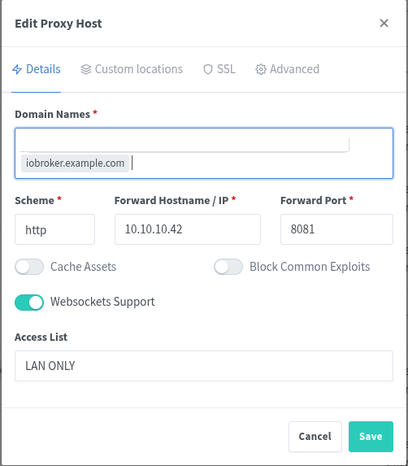
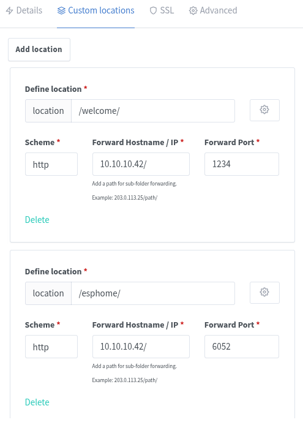
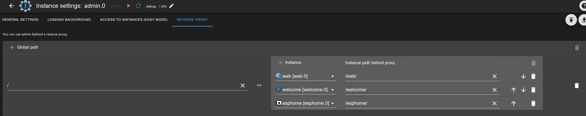

# ioBroker.admin


[](https://www.npmjs.com/package/iobroker.admin)


[](https://weblate.iobroker.net/engage/adapters/?utm_source=widget)
[](https://www.npmjs.com/package/iobroker.admin)

User interface for configuration and administration of ioBroker.

**This adapter uses Sentry libraries to automatically report exceptions and code errors to the developers.** For more details and for information how to disable the error reporting see [Sentry-Plugin Documentation](https://github.com/ioBroker/plugin-sentry#plugin-sentry)! Sentry reporting is used starting with js-controller 3.0.

## JSON config schema

The JSON config schema description can be found at [JSON config schema](/packages/jsonConfig/SCHEMA.md).

## Using common.localLink

-   `%ip%` - ioBroker ip address (address of the admin)
-   `%secure%` or `%protocol%` - read from `native.secure` the value and use http or https
-   `%web_protocol%` - looking for the first instance of web (e.g., `web.0`) and get `native.secure` from `system.adapter.web.0`
-   `%instance%` - instance of the adapter
-   `%someField%` - get someField from `native` of this adapter instance
-   `%web.0_bind%` - get `native.bind` from `system.adapter.web.0`
-   `%native_someField%` - get someField from `native` of this adapter instance

## Scheduled restart

Some adapters are not stable or connection disappears after one or two days.
To fix this, there is a scheduled restart setting.
To activate scheduled restart, just define CRON condition when to restart adapter.

It is suggested to restart in the night, when no one use the adapter, e.g. `0 3 * * *` - at 3:00 every day.

## Let's Encrypt Certificates

To manage and update, let's encrypt certificates you need to use [`iobroker.acme`](https://github.com/iobroker-community-adapters/ioBroker.acme) adapter.

You will have so-called "collections" of certificates. Each collection has its own domains.
You can select in configuration of admin adapter if and which collection to use.

## Simple instance's settings page

The user has the possibility to limit the access to the instance configuration dialog.
For that, the option "Allow access only to specific instances" must be activated.
It could be found on the "Access to the instances" tab.
Additionally, the allowed instances should be selected in the appeared configuration table.

If this option is disabled, the simple configuration page could be accessed under `http://IP:8081/configs.html`

## Reverse proxy

Please be sure that you forward not only the http/https requests, but the web-socket traffic too. It is essential for communication.

From version 6.1.0 you have the possibility to tune intro page for usage with reverse proxy.

### Example

Your `ioBroker.admin` runs on port 8081 behind reverse proxy with domain `iobroker.mydomain.com` under path `/ioBrokerAdmin/`.
And you set up e.g., nginx to forward the requests to the `http://local-iobroker.IP:8081`.

The same is with your web instance: `https://iobroker.mydomain.com/ioBrokerWeb/ => http://local-iobroker.IP:8082`.
And with rest-api instance: `https://iobroker.mydomain.com/ioBrokerAPI/ => http://local-iobroker.IP:8093`.

You can add the following lines into Reverse Proxy tab to let Intro tab run behind reverse proxy properly:

| Global path       | Instance      | Instance path behind proxy |
|-------------------|---------------|----------------------------|
| `/ioBrokerAdmin/` | `web.0`       | `/ioBrokerWeb/`            |
|                   | `rest-api.0`  | `/ioBrokerAPI/`            |
|                   | `admin.0`     | `/ioBrokerAdmin/`          |
|                   | `eventlist.0` | `/ioBrokerWeb/eventlist/`  |

So all links of instances that use web server, like `eventlist`, `vis`, `material` and so on will use `https://iobroker.mydomain.com/ioBrokerWeb/` path

### Extended reverse proxy example (with screenshots)

Below is a more complete example showing how a reverse proxy (e.g. Nginx Proxy Manager) can be configured and how the Admin UI resolves links after mapping.

> NOTE: At the moment the admin UI itself still needs to be effectively served from the web root `/` of the host. login and other hardcoded urls do not yet respect another base path (see limitation discussion here: https://github.com/ioBroker/ioBroker.admin/issues/1660#issuecomment-2360056439).

#### 1. Base host / root mapping

Map the public root (or a dedicated host like `https://iobroker.example.com/`) directly to your Admin instance (default port 8081):



#### 2. Custom locations for other services

Add additional custom locations for web / REST / other adapter frontends. Each location forwards to the respective local port (e.g. web.0 on 8082, rest-api.0 on 8093):



Example custom locations (Nginx style):
```
/location /web/  => http://LOCAL_IOBROKER_IP:8082/
/location /welcome/  => http://LOCAL_IOBROKER_IP:1234/
/location /esphome/  => http://LOCAL_IOBROKER_IP:6052/
```
(Adjust paths/ports for your environment.)

#### 3. Configure mappings in Admin Reverse Proxy tab

Enter the same paths so that Intro / Instances pages rewrite adapter links correctly:

| Global path | Instance     | Instance path behind proxy |
|-------------|--------------|----------------------------|
| `/`         | `web.0`      | `/web/`                    |
|             | `rest-api.0` | `/api/`                    |
|             | `esphome.0`  | `/esphome/`                |

> If you keep Admin on `/` you usually do not need to list `admin.0`, but adding it does not hurt and can make intent explicit.

After saving, the Intro screen rewrites links so that all web‑served adapters open under the correct prefixed paths:



#### 4. Limitations & compatibility

* Admin root requirement: As stated above, full relocation of Admin itself under a sub‑path (e.g. `/admin/`) is not yet supported.
* Adapter path awareness: Not every adapter UI is currently path‑aware. While generic `localLink` rewriting covers many cases, some UIs still assume they are hosted at the domain root. Known examples:
  * `vis` (classic) – NOT fully working behind a sub‑path today.
  * `vis-2` – generally more path tolerant, but custom widgets or legacy resources may still use absolute paths.
  * Any adapter serving hard‑coded absolute URLs (starting with `/`) may need manual fixes until updated upstream.
* Mixed content: If you terminate TLS at the proxy (HTTPS) but contact adapters over HTTP internally, make sure all external links are rewritten to HTTPS to avoid browser mixed-content blocks.
* WebSocket forwarding: Ensure `Upgrade` and `Connection` headers are passed through. In Nginx, this typically means adding:
```
proxy_set_header Upgrade $http_upgrade;
proxy_set_header Connection "upgrade";
```
(old checking the websocket support box, if using proxy manager)
* Trailing slashes: Always keep a trailing slash in the mapped path (e.g. `/web/`) and location, so nginx does path rewriting. 
This makes simple cases like the welcome adapter above work, because it only sees a / path -> correctly serves its index.html.

#### 5. Quick troubleshooting checklist

| Symptom                            | Likely cause                         | Action                                                |
|------------------------------------|--------------------------------------|-------------------------------------------------------|
| Blank or partial Admin UI          | Admin mounted under sub‑path only    | Keep Admin at `/` (see limitation)                    |
| Adapter link opens wrong host/port | Missing entry in Reverse Proxy tab   | Add mapping row and save                              |
| 404 for adapter JS/CSS             | Missing trailing slash in location   | Add trailing slash to location and mapping            |
| WebSocket errors in console        | Proxy not forwarding upgrade headers | Add `proxy_set_header Upgrade` / `Connection` headers |
| vis UI broken                      | Adapter not path‑aware               | Keep on root or wait for adapter update               |

## Used icons

This project uses icons from [Flaticon](https://www.flaticon.com/).

ioBroker GmbH has a valid license for all used icons.
The icons may not be reused in other projects without the proper flaticon license or flaticon subscription.

## Changelog
<!--
	### **WORK IN PROGRESS**
-->
### 7.7.5 (2025-10-21)
- (@GermanBluefox) Improvement of categories: drag&drop, visibility

### 7.7.4 (2025-10-19)
- (@copilot) Added missing filterFunc property to jsonConfig objectId schema to match documentation and implementation
- (@copilot, @SimonFischer04) Added extended reverse proxy example section with screenshots, limitations (admin root requirement), and adapter compatibility notes
- (@copilot, @SimonFischer04) Fixed instances page reverse proxy link mapping so adapter localLinks are rewritten to the configured proxy paths (prefix matching + web port replacement, with duplicate link collapse)
- (@copilot, @SimonFischer04) Fixed intro page reverse proxy link remapping so links are correctly rewritten immediately and after navigating away and back (load reverseProxy config before instance scan and use prefix startsWith matching)
- (@GermanBluefox) Fixed multi-selection in the select ID dialog

### 7.7.3 (2025-09-25)
- Many GUI changes: See previous changelog below for details

### 7.7.2 (2025-09-24)
- (@copilot) Fixed JSONCONFIG table validator bug where validation errors persisted after deleting table rows
- (@GermanBluefox) Made small fix for JsonConfig component `state`
- (@copilot) Fixed repository refresh issue: repositories are now automatically refreshed when switching repository source (stable/latest) without requiring manual "Check for updates"
- (@copilot) Added CSV file editing support in file browser - CSV files can now be edited directly in the file manager
- (@copilot) Implemented sortable columns for instances table (name, status, memory, ID, host, loglevel)
- (@copilot) Fixed adapter license icon linking to use commercial license URL instead of GitHub license
- (@copilot) Fixed license icon spacing in list view to maintain consistent layout
- (@GermanBluefox) Allows entering minus values with JsonConfig number component
- (@copilot) Fixed textIP checkbox inconsistency between Objects and States tabs for the same host configuration
- (@GermanBluefox) Added icon to `www` folder for windows
- (@copilot) Confirmed and documented Copilot issue handling guidelines: PRs use neutral language (no "fixes" keywords), issues closed manually by maintainers, and "fixed" labels added when appropriate
- (@copilot) Enhanced Copilot instructions to make issue management policy more prominent - no auto-closing issues, manual validation required
- (@copilot) Enhanced repository timestamp display to show both generated and read timestamps - shows when repository data was generated and when it was last read by admin backend
- (@copilot) Fixed jsonConfig port validation to properly account for bind addresses, allowing the same port on different IP addresses
- (@copilot) Added error indicators to JSON Config tabs and accordions to improve the visibility of validation errors
- (@copilot) Added export/import functionality for accordion sections in JsonConfig allowing users to save accordion data as JSON files and import them back with replace or add options
- (@copilot) Fixed time difference warning that incorrectly appeared when the browser tab was inactive for a while
- (@copilot) For GitHub-installed adapters, show version + commit hash instead of just version
- (@copilot) Fixed table export error when table items contain null values
- (@copilot) Object Browser: Added formatted duration display for values with role "value.duration" - shows time durations in HH:mm:ss format instead of raw seconds
- (@copilot) Enhanced GitHub Actions to skip tests when only README.md is changed, speeding up CI for Copilot PRs (tested with mixed file changes)
- (@GermanBluefox) Added the docker checker in JSON config
- (@copilot) Fixed js-controller update notifications to use "The js-controller" instead of "Adapter js-controller"
- (@copilot) Fixed JSONConfig sendTo jsonData attribute parser problem where backslashes (\) in text inputs caused JSON parsing errors
- (@copilot) Fixed step type behavior in chart display - "Schritte" now shows value until next point (step after) instead of step before
- (@copilot) Added all three-step type options (stepStart, stepMiddle, stepEnd) to chart display with clearer descriptions
- (@copilot) Fixed React error #62 in the Files tab caused by malformed CSS calc() function
- (@copilot) Added loading indicator to JSONConfig autocompleteSendTo component during sendTo operations
- (@copilot) Mark adapters removed from repository with "not maintained" text instead of empty version field
- (@copilot) Enhanced responsive design: modals and popups now use full screen on xs and sm breakpoints
- (@copilot) Added logout dropdown menu to user icon for improved user experience
- (@copilot) Updated OAuth2 documentation in DEVELOPER.md to include both cloud-based and direct callback approaches with clear guidance on when to use each method
- (@copilot) Only show adapters with satisfied dependencies in update all dialog
- (@copilot) Added new `readOnly` attribute for jsonEditor in jsonConfig - allows opening the editor to view JSON content without allowing modifications
- (@GermanBluefox) Reading of same instances was optimized in GUI
- (@GermanBluefox) Do not show the http page if admin is secured
- (@GermanBluefox) Show loading progress for custom tabs
- (@GermanBluefox) Fixing change of the language in the admin

### 7.7.1 (2025-06-20)
- (@GermanBluefox) Fixing clearing of the filter on the object tab

## License

The MIT License (MIT)

Copyright (c) 2014-2025 bluefox <dogafox@gmail.com>
