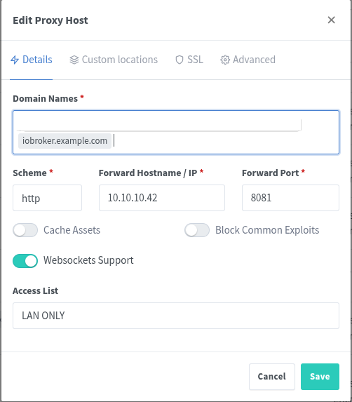
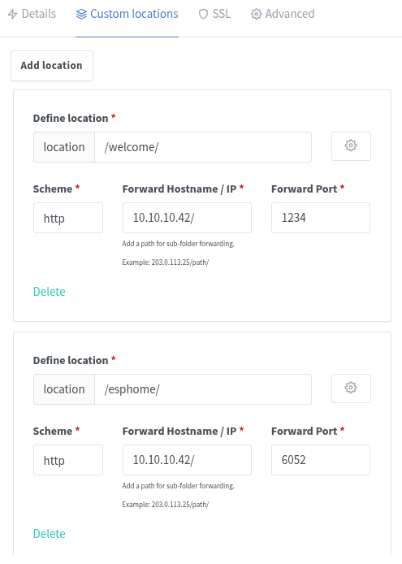
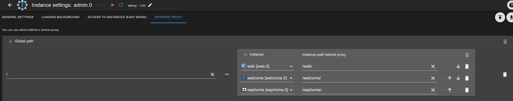

# ioBroker.admin


[](https://www.npmjs.com/package/iobroker.admin)


[](https://weblate.iobroker.net/engage/adapters/?utm_source=widget)
[](https://www.npmjs.com/package/iobroker.admin)

User interface for configuration and administration of ioBroker.

**This adapter uses Sentry libraries to automatically report exceptions and code errors to the developers.** For more details and for information on how to disable the error reporting, see [Sentry-Plugin Documentation](https://github.com/ioBroker/plugin-sentry#plugin-sentry)! Sentry reporting is used starting with js-controller 3.0.

## JSON config schema

The JSON config schema description can be found at [JSON config schema](/packages/jsonConfig/SCHEMA.md).

## Using common.localLink

-   `%ip%` - ioBroker ip address (address of the admin)
-   `%secure%` or `%protocol%` - read from `native.secure` the value and use http or https
-   `%web_protocol%` - looking for the first instance of web (e.g., `web.0`) and get `native.secure` from `system.adapter.web.0`
-   `%instance%` - instance of the adapter
-   `%someField%` - get someField from `native` of this adapter instance
-   `%web.0_bind%` - get `native.bind` from `system.adapter.web.0`
-   `%native_someField%` - get someField from `native` of this adapter instance

## Scheduled restart

Some adapters are not stable, or the connection disappears after one or two days.
To fix this, there is a scheduled restart setting.
To activate scheduled restart, just define CRON condition when to restart adapter.

It is suggested to restart in the night, when no one uses the adapter, e.g. `0 3 * * *` - at 3:00 every day.

## Let's Encrypt Certificates

To manage and update, let's encrypt certificates you need to use [`iobroker.acme`](https://github.com/iobroker-community-adapters/ioBroker.acme) adapter.

You will have so-called "collections" of certificates. Each collection has its own domains.
You can select in the configuration of the admin adapter if and which a collection to use.

## Simple instance's settings page

The user has the possibility to limit the access to the instance configuration dialog.
For that, the option "Allow access only to specific instances" must be activated.
It could be found on the "Access to the instances" tab.
Additionally, the allowed instances should be selected in the appeared configuration table.

If this option is disabled, the simple configuration page could be accessed under `http://IP:8081/configs.html`

## AI assistant

The admin interface includes an AI assistant (the floating button in the lower-right corner). It can answer
questions about your ioBroker system, recommend adapters for a device or service, and — in "Actions" mode — make
changes after your explicit confirmation. The assistant must first be enabled in the admin instance settings
(`native.disableMcp` must be off); then pick an AI provider, credential and model in the assistant settings dialog.

### Using the assistant without an API key (external MCP client)

If you do not want to configure an AI provider/API key inside ioBroker, you can instead drive the assistant from
an external AI client (Claude Desktop, Codex, Gemini CLI, …). The client connects directly to ioBroker through the
MCP (Model Context Protocol) server.

Open the assistant and click the **"Use without an API key"** button (the cable icon in the header). The dialog
walks you through three steps:

1.  **Install the MCP server** — install the `iobroker.mcp` adapter, ideally as a web extension of your `web`
    (or `admin`) instance. It exposes ioBroker's tools to any MCP-compatible AI client. The dialog shows whether
    the adapter is already installed.
2.  **Add the MCP server in your AI client** — register a new MCP server in your client using the URL shown in the
    dialog, e.g. `http(s)://<host>:<port>/mcp`. The dialog lists the actual endpoint(s) of your installation (the
    embedded admin endpoint and any `web`/`mcp` instances) together with a copy button.
3.  **System prompt** — the same dialog also shows the exact system prompt the built-in assistant uses, with a
    read-only/actions toggle and a copy button. It is intentionally not reproduced here; copy it from the dialog and
    paste it as the system/instructions prompt in your AI client to get the same behaviour.

## Reverse proxy

Please be sure that you forward not only the http/https requests, but the web-socket traffic too. It is essential for communication.

From version 6.1.0 you have the possibility to tune the intro page for usage with reverse proxy.

### Example

Your `ioBroker.admin` runs on port 8081 behind reverse proxy with domain `iobroker.mydomain.com` under path `/ioBrokerAdmin/`.
And you set up e.g., nginx to forward the requests to the `http://local-iobroker.IP:8081`.

The same is with your web instance: `https://iobroker.mydomain.com/ioBrokerWeb/ => http://local-iobroker.IP:8082`.
And with rest-api instance: `https://iobroker.mydomain.com/ioBrokerAPI/ => http://local-iobroker.IP:8093`.

You can add the following lines into the Reverse Proxy tab to let the Intro tab run behind the reverse proxy properly:

| Global path       | Instance      | Instance path behind proxy |
|-------------------|---------------|----------------------------|
| `/ioBrokerAdmin/` | `web.0`       | `/ioBrokerWeb/`            |
|                   | `rest-api.0`  | `/ioBrokerAPI/`            |
|                   | `admin.0`     | `/ioBrokerAdmin/`          |
|                   | `eventlist.0` | `/ioBrokerWeb/eventlist/`  |

So all links of instances that use web server, like `eventlist`, `vis`, `material` and so on will use `https://iobroker.mydomain.com/ioBrokerWeb/` path

### Extended reverse proxy example (with screenshots)

Below is a more complete example showing how a reverse proxy (e.g. Nginx Proxy Manager) can be configured and how the Admin UI resolves links after mapping.

> NOTE: At the moment the admin UI itself still needs to be effectively served from the web root `/` of the host. login and other hardcoded urls do not yet respect another base path (see limitation discussion here: https://github.com/ioBroker/ioBroker.admin/issues/1660#issuecomment-2360056439).

#### 1. Base host / root mapping

Map the public root (or a dedicated host like `https://iobroker.example.com/`) directly to your Admin instance (default port 8081):



#### 2. Custom locations for other services

Add additional custom locations for web / REST / other adapter frontends. Each location forwards to the respective local port (e.g. `web.0` on 8082, rest-api.0 on 8093):



Example custom locations (Nginx style):
```
/web/  => http://LOCAL_IOBROKER_IP:8082/
/welcome/  => http://LOCAL_IOBROKER_IP:PORT_CONFIGURED_IN_WELCOME_INSTANCE_SETTINGS/
/esphome/  => http://LOCAL_IOBROKER_IP:6052/
```
If you have views imported from vis into vis-2, it is possible images / ... are still used from the old vis path. 
In this case (or to be on the safe side - just also configuring them should not break other things) you probably also want to add these locations (NOTE: no trailing / here!):
```
/vis.0 => http://LOCAL_IOBROKER_IP:8082
/vis/widgets => http://LOCAL_IOBROKER_IP:8082
/vis-2/widgets => http://LOCAL_IOBROKER_IP:8082
/icons-mfd-svg => http://LOCAL_IOBROKER_IP:8082
/icons-material-png => http://LOCAL_IOBROKER_IP:8082
```
(Adjust paths/ports for your environment.)

#### 3. Configure mappings in the Admin Reverse Proxy tab

Enter the same paths so that Intro / Instances pages rewrite adapter links correctly. Also add paths for all adapters running as web extension (like rest-api, ...). Obviously, you only need to configure what you are actually using. Here are some examples:

| Global path | Instance     | Instance path behind proxy |
|-------------|--------------|----------------------------|
| `/`         | `web.0`      | `/web/`                    |
|             | `welcome.0`  | `/welcome/`                |
|             | `rest-api.0` | `/web/rest-api/`           |
|             | `esphome.0`  | `/esphome/`                |

> If you keep Admin on `/` you usually do not need to list `admin.0`, but adding it does not hurt and can make intent explicit.

After saving, the Intro screen rewrites links so that all web‑served adapters open under the correct prefixed paths:



#### 4. Limitations & compatibility

* Admin root requirement: As stated above, full relocation of Admin itself under a sub‑path (e.g. `/admin/`) is not yet supported.
* Adapter path awareness: Not every adapter UI is currently path‑aware. While generic `localLink` rewriting covers many cases, some UIs still assume they are hosted at the domain root. Known examples:
  * `vis` (classic) – NOT fully working behind a sub‑path today.
  * `vis-2` – generally more path tolerant, but custom widgets or legacy resources may still use absolute paths.
  * Any adapter serving hard‑coded absolute URLs (starting with `/`) may need manual fixes until updated upstream. Please open issues in the respective adapter repositories to notify maintainers.
* Mixed content: If you terminate TLS at the proxy (HTTPS) but contact adapters over HTTP internally, make sure all external links are rewritten to HTTPS to avoid browser mixed-content blocks.
* WebSocket forwarding: Ensure `Upgrade` and `Connection` headers are passed through. In Nginx, this typically means adding:
```
proxy_set_header Upgrade $http_upgrade;
proxy_set_header Connection "upgrade";
```
(or checking the websocket support box, if using proxy manager)
* Trailing slashes: Often a trailing slash in the mapped path (e.g. `/web/`) and location are required for path unaware adapters. 
Then nginx does path rewriting, which makes most cases like the welcome adapter above work, because it only sees a / path -> correctly serves its index.html.

#### 5. Quick troubleshooting checklist

| Symptom                            | Likely cause                         | Action                                                                                                                                                       |
|------------------------------------|--------------------------------------|--------------------------------------------------------------------------------------------------------------------------------------------------------------|
| Blank or partial Admin UI          | Admin mounted under sub‑path only    | Keep Admin at `/` (see limitation)                                                                                                                           |
| Adapter link opens wrong host/port | Missing entry in Reverse Proxy tab   | Add mapping row and save                                                                                                                                     |
| 404 for adapter JS/CSS             | Missing trailing slash in location   | Add trailing slash to location and mapping                                                                                                                   |
| WebSocket errors in console        | Proxy not forwarding upgrade headers | Add `proxy_set_header Upgrade` / `Connection` headers                                                                                                        |
| other (loading) issue              | Adapter not path‑aware               | Keep on root or wait for adapter update. Please open an issue in the adapters repository so the maintainers are aware about it and the issue can be tracked. |

## Used icons

This project uses icons from [Flaticon](https://www.flaticon.com/).

ioBroker GmbH has a valid license for all used icons.
The icons may not be reused in other projects without the proper flaticon license or flaticon subscription.

## Changelog
### **WORK IN PROGRESS**
- (@GermanBluefox) Allowed creating an AI API key directly from the assistant settings dialog
- (@GermanBluefox) Added provider logos (incl. DeepSeek) to the AI assistant provider and credential selectors
- (@GermanBluefox) The adapter-core version will be updated if required by start
- (@GermanBluefox) Show status of the instance in the web-extension mode

### 7.9.10 (2026-06-22)
- (@GermanBluefox) Added a dialog describing how to use the AI assistant without an API key (external MCP client)
- (@GermanBluefox) Updated device manager
- (@GermanBluefox) Added possibility to see the prompt and use it outside of assistant

### 7.9.9 (2026-06-21)
- (@GermanBluefox) Correcting the change of the AI providers

### 7.9.6 (2026-06-20)
- (@GermanBluefox) Added "between" news rule
- (@GermanBluefox) Better config-manager layout
- (@GermanBluefox) Added filtering options for config-manager

### 7.9.4 (2026-06-18)
- (@GermanBluefox) Moved the MCP server to a separate package
- (@GermanBluefox) Corrected the background color of states with overloaded colors
- (@GermanBluefox) Added gemini template for credentials
- (@GermanBluefox) Added sorting of adapters by creation date in the adapter tab

### 7.9.2 (2026-06-15)
- (@GermanBluefox) AI must be enabled first in the settings to be used in the admin interface

## License

The MIT License (MIT)

Copyright (c) 2014-2026 bluefox <dogafox@gmail.com>
