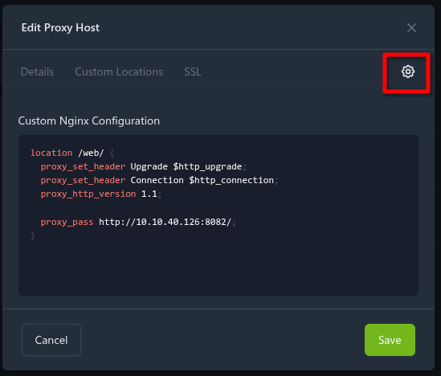

# Reverse proxy

Please be sure that you forward not only the http/https requests, but the web-socket traffic too. It is essential for communication.

From version 6.1.0 you have the possibility to tune intro page for usage with reverse proxy.

## Example

Your `ioBroker.admin` runs on port 8081 behind reverse proxy with domain `iobroker.mydomain.com` under path `/ioBrokerAdmin/`.
And you set up e.g., nginx to forward the requests to the `http://local-iobroker.IP:8081`.

The same is with your web instance: `https://iobroker.mydomain.com/ioBrokerWeb/ => http://local-iobroker.IP:8082`.
And with rest-api instance: `https://iobroker.mydomain.com/ioBrokerAPI/ => http://local-iobroker.IP:8093`.

You can add the following lines into Reverse Proxy tab to let Intro tab run behind reverse proxy properly:

| Global path       | Instance      | Instance path behind proxy |
|-------------------|---------------|----------------------------|
| `/ioBrokerAdmin/` | `web.0`       | `/ioBrokerWeb/`            |
|                   | `rest-api.0`  | `/ioBrokerAPI/`            |
|                   | `admin.0`     | `/ioBrokerAdmin/`          |
|                   | `eventlist.0` | `/ioBrokerWeb/eventlist/`  |

So all links of instances that use web server, like `eventlist`, `vis`, `material` and so on will use `https://iobroker.mydomain.com/ioBrokerWeb/` path

## Extended reverse proxy example (with screenshots)

Below is a more complete example showing how a reverse proxy (e.g. Nginx Proxy Manager) can be configured and how the Admin UI resolves links after mapping.

> NOTE: At the moment the admin UI itself still needs to be effectively served from the web root `/` of the host. login and other hardcoded urls do not yet respect another base path (see limitation discussion here: https://github.com/ioBroker/ioBroker.admin/issues/1660#issuecomment-2360056439).

### 1. Base host / root mapping

Map the public root (or a dedicated host like `https://iobroker.example.com/`) directly to your Admin instance (default port 8081):


### 2. Custom locations for other services

Add additional custom locations for web / REST / other adapter frontends. Each location forwards to the respective local port (e.g. web.0 on 8082, rest-api.0 on 8093):


Example custom locations (Nginx style):
```
location /welcome/  => http://LOCAL_IOBROKER_IP:1234/
location /esphome/  => http://LOCAL_IOBROKER_IP:6052/
```
(Adjust paths/ports for your environment.)

Configuring the location for web is a bit more complicated, as it also needs websocket support. To do this in nginx proxy manager, you need to add the following custom nginx configuration.
```
location /web/ {
  proxy_set_header Upgrade $http_upgrade;
  proxy_set_header Connection $http_connection;
  proxy_http_version 1.1;
  
  proxy_pass http://LOCAL_IOBROKER_IP:8082/;
}
```


### 3. Configure mappings in Admin Reverse Proxy tab

Enter the same paths so that Intro / Instances pages rewrite adapter links correctly:

| Global path | Instance     | Instance path behind proxy |
|-------------|--------------|----------------------------|
| `/`         | `web.0`      | `/web/`                    |
|             | `welcome.0`  | `/welcome/`                |
|             | `esphome.0`  | `/esphome/`                |
|             | `rest-api.0` | `/web/rest-api/api-doc/`   |

> If you keep Admin on `/` you usually do not need to list `admin.0`, but adding it does not hurt and can make intent explicit.

After saving, the Intro screen rewrites links so that all web‑served adapters open under the correct prefixed paths:


### 4. Limitations & compatibility

* Admin root requirement: As stated above, full relocation of Admin itself under a sub‑path (e.g. `/admin/`) is not yet supported.
* Adapter path awareness: Not every adapter UI is currently path‑aware. While generic `localLink` rewriting covers many cases, some UIs still assume they are hosted at the domain root. See the [Tested adapters](#tested-adapters) table below. Any adapter serving hard‑coded absolute URLs (starting with `/`) may need manual fixes until updated upstream.

#### Tested adapters

The following adapters have been tested behind a path‑prefixed reverse proxy (Admin at host root `/`, other services under sub‑paths such as `/web/`). Not being listed here does not necessarily mean an adapter is incompatible, just that it has not been explicitly tested yet. At least everything running as a web extension and using standard iobroker tooling - but also others - should mostly just work.

Contributions welcome via PR.

✅ works · ⚠️ partial / with limitations · ❌ does not work

| Adapter                                                 | Works | Minimum versions             | Notes                                                                                                                                                             |
|---------------------------------------------------------|:-----:|------------------------------|-------------------------------------------------------------------------------------------------------------------------------------------------------------------|
| [admin](https://github.com/ioBroker/ioBroker.admin)     | ⚠️ | admin ≥ 7.7.18               | Only when served at host root `/`; sub‑path relocation (e.g. `/admin/`) not supported                                                                             |
| [echarts](https://github.com/ioBroker/ioBroker.echarts) | ✅ | web ≥ 8.3.0, echarts ≥ 3.2.0 |                                                                                                                                                                   |
| [esphome](https://github.com/DrozmotiX/ioBroker.esphome) | ✅ | —                            | Shown in extended example; dedicated proxy path (e.g. `/esphome/`)                                                                                                |
| [rest-api](https://github.com/ioBroker/ioBroker.rest-api) | ⚠️ | —                            | Swagger UI 'Try it out' does not respect sub-path / tries to call root \<host\>/rest-api/... Manual call to correct  \<host\>/web/rest-api/...  url works fine.   |
| [vis](https://github.com/ioBroker/ioBroker.vis)         | ❌ | —                            | Not path‑aware; UI broken behind a sub‑path                                                                                                                       |
| [vis-2](https://github.com/ioBroker/ioBroker.vis-2)     | ⚠️ | —                            | Generally path tolerant; custom widgets or legacy resources may use absolute paths. Also see *1                                                                   |
| [web](https://github.com/ioBroker/ioBroker.web)         | ✅ | —                            | Base for web‑hosted adapter UIs; proxy under e.g. `/web/`. Important: Also requires correct configuration of web adapter: see bellow "6. Configuring Web Adapter" |
| [welcome](https://github.com/ioBroker/ioBroker.welcome) | ✅ | —                            |                                                                                                                                                                   |
* Mixed content: If you terminate TLS at the proxy (HTTPS) but contact adapters over HTTP internally, make sure all external links are rewritten to HTTPS to avoid browser mixed-content blocks.
* WebSocket forwarding: Ensure `Upgrade` and `Connection` headers are passed through. In Nginx, this typically means adding (also for custom locations like `/web/` !):
```
proxy_set_header Upgrade $http_upgrade;
proxy_set_header Connection "upgrade";
```
(or checking the websocket support box, if using proxy manager)
* Trailing slashes: Most of the time keep a trailing slash in the mapped path (e.g. `/web/`) and location, so nginx does path rewriting. 
This makes simple cases like the welcome adapter above work, because it only sees a / path -> correctly serves its index.html.

#### *1 Vis quirks
Some known quirks / workarounds with vis-2 (widgets). Especially if views got imported from old vis-1.x.
Probably a good idea to also configure those paths in the reverse proxy (NOTE: no trailing slashes here):
```
location /vis.0  => http://LOCAL_IOBROKER_IP:8082
location /vis/widgets  => http://LOCAL_IOBROKER_IP:8082
location /vis-2/widgets  => http://LOCAL_IOBROKER_IP:8082
location /icons-mfd-svg  => http://LOCAL_IOBROKER_IP:8082
location /icons-material-png  => http://LOCAL_IOBROKER_IP:8082
```

### 5. Quick troubleshooting checklist

| Symptom                            | Likely cause                         | Action                                                |
|------------------------------------|--------------------------------------|-------------------------------------------------------|
| Blank or partial Admin UI          | Admin mounted under sub‑path only    | Keep Admin at `/` (see limitation)                    |
| Adapter link opens wrong host/port | Missing entry in Reverse Proxy tab   | Add mapping row and save                              |
| 404 for adapter JS/CSS             | Missing trailing slash in location   | Add trailing slash to location and mapping            |
| WebSocket errors in console        | Proxy not forwarding upgrade headers | Add `proxy_set_header Upgrade` / `Connection` headers |
| vis UI broken                      | Adapter not path‑aware               | Keep on root or wait for adapter update               |

### 6. Configuring Web Adapter
You also need to put the web adapters root path (what you configured in reverse proxy) into web adapter Instance settings: Tab "Advanced" - field "Root path
". So in the example above it would be `/web/`.

Also enable the `Use pure web-sockets (iobroker.ws)` option in the `Main Settings` tab of web adapter instance settings. All the tests above were done with this option enabled. If not using this options you likely get different results (f.e. required to use url workarounds like `http://iobroker-test.revproxy.home.arpa/web//echarts/index.html?preset=echarts.0.preset_1` - note the double slash after web). As the web adapter recommends to enable this option anyway, just enable it if you don't see any other issues. It will likely safe you some headaches and weird issues.

#### Technical details (only relevant for devs)
Technical details about what this option does in web / why it's required.

When visiting a page served by the web adapter, your browser first requests `_socket/info.js` (dynamically generated and served by web adapter). The `var socketUrl` in there actually only supports host:port (no path), so (to not break existing setups), https://github.com/ioBroker/socket-client/pull/60 and https://github.com/ioBroker/ioBroker.web/pull/681 introduced a dedicated `var socketPath = "/web/";` (filled from the root path set in adapter configuration).
The socket client will then correctly try to connect to e.g. `http://iobroker-test.revproxy.home.arpa/web/socket.io/?ws=true&EIO=3&transport=polling&t=PwXUr0T&sid=0AHBuqNcP4EqMPaNAACR` or `ws://iobroker-test.revproxy.home.arpa/web/?sid=1780827297411&name=echarts-show`.

Why not just use the root (admins) socket (e.g. `ws://iobroker-test.revproxy.home.arpa/?sid=1780827297411&name=echarts-show`)?: 
Admin needs authentication and web usually not, so you would have to be logged in to admin for your views (served by web!) to load. Also, when not using a proxy setup, it would also use the web adapters socket (request to :8082/?sid=...) - so also using the web adapters socket for reverse proxy setup is the correct approach.
