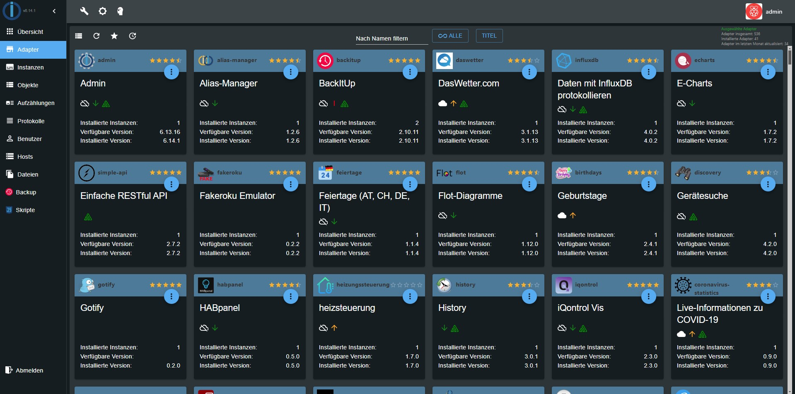

# Admin

O adaptador de administração é usado para configurar toda a instalação do ioBroker e todos os seus adaptadores.
Ele fornece uma interface web, que pode ser aberta por "http://<endereço IP do servidor>:8081"
no navegador da web. Este adaptador é instalado automaticamente junto com o ioBroker.

## Configuração:

A caixa de diálogo de configuração do adaptador "admin" fornece as seguintes configurações:

**IP:** o endereço IP do servidor web "admin" pode ser escolhido aqui.
Diferentes endereços IPv4 e IPv6 podem ser selecionados. O valor padrão é 0.0.0.0\.
Se você acha que 0.0.0.0 é uma configuração inválida, por favor, deixe-o ficar lá, porque
é absolutamente válido. Se você alterar o endereço, poderá acessar o servidor da web
somente através deste endereço. **Port:** Você pode especificar a porta do servidor web "admin".
Se houver mais servidores web no PC ou dispositivo, a porta deve ser personalizada para evitar problemas
de uma alocação de porta dupla. **Codificação:** habilite esta opção se o protocolo https seguro deve ser usado.

**Autenticação:** Se você quiser a autenticação com login/senha, você deve habilitar esta caixa de seleção.
A senha padrão para o usuário "admin" é "iobroker" **Buffer:** para acelerar o carregamento das páginas, ative esta opção.
Normalmente, apenas o desenvolvedor deseja ter essa opção desmarcada.

## Manipulação:

A página principal do admin consiste em várias abas. **Adaptador:** Aqui as ocorrências de
um adaptadores podem ser instalados ou excluídos. Com o botão de atualização

no canto superior esquerdo podemos obter se as novas versões dos adaptadores estiverem disponíveis.

As versões disponíveis e instaladas do adaptador são mostradas. Para uma visão geral, o estado do
adaptador é colorido (vermelho = no planejamento; laranja = alfa; amarelo = beta). As atualizações para uma versão mais recente do
o adaptador é feito aqui também. Se houver uma versão mais recente, as letras da guia ficarão verdes.
Se o ícone do ponto de interrogação na última coluna estiver ativo, você poderá ir até o site com informações do adaptador.
O adaptador disponível é classificado em ordem alfabética. A instância já instalada está na parte superior da lista.

**Instância:** A instância já instalada é listada aqui e pode ser configurada de acordo. Se o título do
exemplo são sublinhados, você pode clicar nele e o site correspondente será aberto.

**Objetos:** os objetos gerenciados (por exemplo, setup / variables / programs do hardware conectado)

**Estados:** os estados atuais (valores dos objetos)
Se o histórico do adaptador estiver instalado, você poderá registrar os pontos de dados escolhidos.
Os pontos de dados registrados são selecionados à direita e aparecem com um logotipo verde.

**Scripts:** esta aba estará ativa somente se o adaptador "javascript" estiver instalado.

**Node-red:** esta aba é visível apenas se o adaptador "node-red" estiver instalado e ativado.

**Hosts:** o computador no qual o ioBroker está instalado. Aqui, a versão mais recente do js-controller pode ser instalada.
Se houver uma nova versão, as letras da guia serão verdes. Para procurar uma nova versão, você tem que clicar na atualização
ícone no canto inferior esquerdo.

**Enumeração:** aqui estão listados os favoritos, negociações e espaços da CCU.

**Usuários:** aqui os usuários podem ser adicionados. Para fazer isso, clique no (+). Por padrão, existe um administrador.

**Grupos:** se você clicar no (+) no canto inferior esquerdo, você pode criar grupos de usuários. No menu suspenso, os usuários são atribuídos aos grupos.

**Evento:** Uma lista das atualizações em andamento das condições. **Log:** aqui o log é exibido Na instância da guia, o nível do log logado
da instância única pode ser definida. No menu de seleção, o nível de registro mínimo exibido é selecionado. Se ocorrer um erro
letras do log aparecem em vermelho.