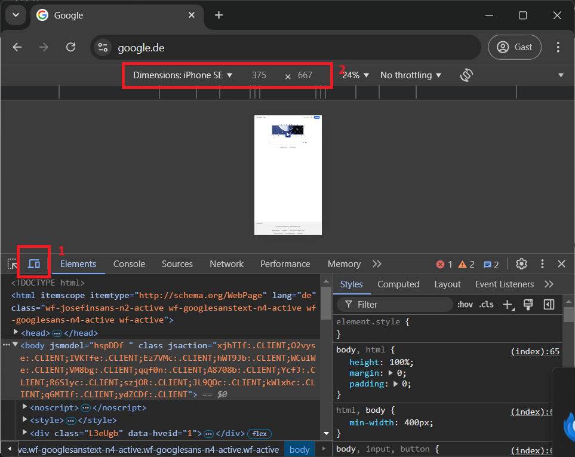

# ioBroker JSON Configuration: A Guide for Beginners

This guide explains how to define configuration options for your ioBroker adapter using JSON. This approach offers a more user-friendly and flexible way to manage adapter settings within the ioBroker Admin interface.

## What you'll need

- ioBroker Admin version 6 (or newer)
- Basic understanding of JSON syntax

## Benefits of JSON Configuration

- Improved user experience for configuring adapters
- Easier integration of complex configuration options
- Clear separation between adapter code and configuration

## Getting Started

1. **Define the Configuration File:**

   - Create a file named `jsonConfig.json` or `jsonConfig.json5` in your adapter's admin directory.
   - JSON5 is a superset of JSON that allows for comments, making the configuration file more readable.

2. **Enable JSON Configuration:**

   - In your adapter's `io-package.json` file, add the following line under the `common` section:

   ```json
   "common": {
       "adminUI": {
           "config": "json"
       }
   }
   ```

3. **Structure of the Configuration File:**

   The configuration file defines a hierarchical structure of tabs, panels, and control elements. \
   Each element has specific attributes that determine its behavior and appearance in the Admin interface.

   jsonConfig automatically ensures that the collected data is recorded as configuration data for the adapter and stored internally so that it can be retrieved and further processed in the adapter.

   The following example would create the following configuration object:

```json5
{
  options1: {
    myPort: 1234,
    options: {
      myType: 1,
    },
    myBool: false,
  },
}
```

_If the attribute name starts with "\_" it will not be saved in the object._

## Example of a jsonConfig with multiple tabs

```json5
{
    "type": "tabs",
    "items": {
        "options1": {
            "type": "panel",
            "label": "Tab1",
            "icon": "base64 svg", // optional
            "items": {
                myPort: {
                    "type": "number",
                    "min": 1,
                    "max": 65565,
                    "label": "Number",
                    "sm": 6, // 1 - 12
                    "validator": "!!data.name", // else error
                    "hidden": "data.myType === 1", // hidden if myType is 1
                    "disabled": "data.myType === 2" // disabled if myType is 2
                },
                "options.myType": { // name could support more than one level
                    "newLine": true, // must start from new row
                    "type": "select",
                    "label": "Type",
                    "sm": 6, // 1 - 12
                    "options": [
                        {"label": "option 1", "value": 1},
                        {"label": "option 2", "value": 2}
                    ]
                },
                "myBool": {
                    "type": "checkbox",
                    "label": "My checkbox",
                },
                "_notSaved":"abc"
            }
        },
        "tab2": {
            "label": "Tab2",
            "type": "panel",
            "disabled": "data.myType === 1",
            "hidden": "data.myType === 2",
        }
    },
}
```

Further examples can be found in many other adapters on GitHub in the respective admin directory.

## Support for developing tools

### VS Code

To enable the validation of the jsonConfig in VS code, the following section must be added to the file ".vscode/settings.json".

```json5
    "json.schemas": [
        {
            "fileMatch": ["admin/jsonConfig.json", "admin/jsonCustom.json", "admin/jsonTab.json"],
            "url": "https://raw.githubusercontent.com/ioBroker/ioBroker.admin/master/packages/jsonConfig/schemas/jsonConfig.json"
        }
    ]
```

## Common Control Elements

A jsonConfig consists of several elements that are structured hierarchically. \
Each of the elements can be of one of the following types.\
Some elements can contain additional child elements.

You can see almost all components in action if you test this adapter: [jsonconfig-demo](https://github.com/mcm4iob/ioBroker.jsonconfig-demo).\
You can install it via GitHub icon in admin by entering `iobroker.jsonconfig-demo` on the npm tab.

- [**`accordion`:**](#accordion) Accordion element for collapsible content (Admin 6.6.0 or newer)
- [**`alive`:**](#alive) Displays if an instance is running (read-only)
- [**`autocomplete`:**](#autocomplete) Input field with autocomplete suggestions
- [**`autocompleteSendTo`:**](#autocompletesendto) Autocomplete control with instance values for sending data
- [**`certificate`:**](#certificate) Manages certificates for secure connections
- [**`certificateCollection`:**](#certificatecollection) Selects a collection for Let's Encrypt certificates
- [**`certificates`:**](#certificates) Universal type for managing different certificate types (from Admin 6.4.0)
- [**`checkbox`:**](#checkbox) Checkbox for boolean values
- [**`checkDocker`:**](#checklicense) Special component to check if the docker available and if yes, you can activate a checkbox
- [**`checkLicense`:**](#checklicense) Very special component to check the license online
- [**`chips`:**](#chips) User can enter words that are added to an array
- [**`color`:**](#color) Color picker
- [**`cron`:**](#cron) Configures cron expressions for scheduling tasks
- [**`custom`:**](#custom) Integrates custom components for specific functionalities (Admin 6 only)
- [**`datePicker`:**](#datepicker) Allows users to select a date
- [**`deviceManager`:**](#devicemanager) show device manager
- [**`divider`:**](#divider) Creates a horizontal line separator
- [**`file`:**](#file) Input field with file selection and optional upload/download capabilities (Admin 6 only)
- [**`fileSelector`:**](#fileselector) Allows users to select files from the system (only Admin6)
- [**`func`:**](#func) Selects a function from the enum.func list (Admin 6 only)
- [**`header`:**](#header) Creates a heading with different sizes (h1-h5)
- [**`image`:**](#image) Uploads or displays an image
- [**`imageSendTo`:**](#imagesendto) Displays an image received from the backend and sends data based on a command
- [**`instance`:**](#instance) Selects an adapter instance
- [**`interface`:**](#interface) Selects the interface from of the host, where the instance runs
- [**`ip`:**](#ip) Input field for IP addresses with advanced options
- [**`jsonEditor`:**](#jsoneditor) JSON editor for complex configuration data
- [**`language`:**](#language) Selects the user interface language
- [**`license`:**](#license) shows the license information if not already accepted.
- [**`number`:**](#number) Numeric input field with min/max values and step size
- [**`oauth2`:**](#oauth2) Make OAuth2 authentication for the adapter (Admin 7.6.18 or newer)
- [**`objectId`:**](#objectid) Selects an object ID with name, color, and icon
- [**`panel`:**](#panel) Tab with items
- [**`password`:**](#password) Password input field
- [**`pattern`:**](#pattern) Read-only field showing a pattern (e.g., URL)
- [**`port`:**](#port) Special input for ports
- [**`qrCode`:**](#qrcode) Displays data as a QR code (Admin 7.0.18 or newer)
- [**`room`:**](#room) Selects a room from the `enum.room` list (Admin 6 only)
- [**`select`:**](#select) Dropdown menu with predefined options
- [**`selectSendTo`:**](#selectsendto) Dropdown menu with instance values for sending data
- [**`sendTo`:**](#sendto) Button that sends a request to an instance
- [**`setState`:**](#setstate) Button that sets an instance's state
- [**`slider`:**](#slider) Slider for selecting a value within a range (Admin 6 only)
- [**`state`:**](#state) Show control or information from the state (admin >= 7.1.0)
- [**`staticImage`:**](#staticimage) Displays a static image
- [**`staticInfo`:**](#staticinfo) Shows static information in preformatted form, like "Title: value unit" (admin >= 7.3.3)
- [**`staticLink`:**](#staticlink) Creates a static link
- [**`staticText`:**](#statictext) Displays static text (e.g., description)
- [**`coordinates`:**](#coordinates) Determines current location and used `system.config` coordinates if not possible in form "latitude,longitude"
- [**`table`:**](#table) Table with rows that can be added, deleted, or reordered
- [**`tabs`:**](#tabs) Tabs with items
- [**`text`:**](#text) Single- or multi-line text input field
- [**`textSendTo`:**](#textsendto) Shows readonly control with the given from the instance values.
- [**`timePicker`:**](#timepicker) Allows users to select a time
- [**`user`:**](#user) Selects a user from the `system.user` list
- [**`uuid`:**](#uuid) Show iobroker UUID

By leveraging JSON configuration, you can create a user-friendly and \
adaptable configuration experience for your ioBroker adapter.

## Example projects

| Type              | Link                                                                                                                                                                                              |
|-------------------|---------------------------------------------------------------------------------------------------------------------------------------------------------------------------------------------------|
| Multiple Tabs:    | [`ioBroker.admin`](https://github.com/ioBroker/ioBroker.admin/blob/master/admin/jsonConfig.json5)                                                                                                 |
| Only one Panel:   | [`ioBroker.dwd`](https://github.com/ioBroker/ioBroker.dwd/blob/master/admin/jsonConfig.json)                                                                                                      |
| Custom component: | [`telegram`](https://github.com/iobroker-community-adapters/ioBroker.telegram/tree/master/src-admin) or in [`pushbullet`](https://github.com/Jens1809/ioBroker.pushbullet/tree/master/src-admin)  |
| Validation:       |                                                                                                                                                                                                   |

## Separation of the large Configurations

## Includes

Requires admin 6.17.1 or newer.

To write complex JSON files, you can include other JSON files.
The included file must be in the same directory as the main file.

```json5
{
  tabs: {
    tab1: {
      type: "panel", // data will be combined with the content of "tab1.json". If the same attribute is defined in both files, the value from the included file will be used.
      "#include": "tab1.json",
    },
  },
}
```

## i18n - Internationalization

There are several options to provide the translations. Only the first one is compatible with our Community Translation Tool Weblate, so it should be favored over the others!

To enable the translation feature, you need to provide and enable the i18n property at the top level of the JSON configuration object.

```json5
{
  i18n: true,
}
```

### Translation in separated files: compatible with weblate

By default, the files must be located in the following directories:

```text
admin/i18n/de/translations.json
admin/i18n/en/translations.json
```

or

```text
admin/i18n/de.json
admin/i18n/en.json
```

Additionally, user can provide the path to `i18n` files, `i18n`: `customI18n` and provide files in admin:

```json5
  i18n: "customI18n",
```

```text
admin/customI18n/de/translations.json
admin/customI18n/en/translations.json
```

or

```text
admin/customI18n/de.json
admin/customI18n/en.json
```

The structure of a file corresponds to the following structure

**en.json:**

```json5
{
  i18nText1: "Open",
  i18nText2: "Close",
  "This is a Text": "This is a Text",
}
```

**de.json:**

```json5
{
  i18nText1: "Öffnen",
  i18nText2: "Schließen",
  "This is a Text": "Dies ist ein Text",
}
```

When searching for a translation, the information in the specific field is used to find the property with the text in the files. If the property is not found, the information from the field remains. It is recommended to enter the text in English.

### Provide translation directly in the fields

Translations can be specified in all fields that can contain text. Examples of fields are label, title, tooltip, text, etc.

```json5
   "type": "text",
   "label: {
        "en": "house",
        "de": "Haus"
    }
}
```

### Provide translation directly in the i18n

The translations can also be provided directly as an object in the `i18n` attribute at the top level of the `jsonConfig` object.

When searching for a translation, the information in the specific field is used to find the property with the text in the i18n object.
If the property is not found, the information from the field remains.
It is recommended to enter the text in English.

## Element types

Each element can have [common attributes](#common-attributes-of-controls) and the special attributes belonging to the respective type as follows

### `tabs`

Tabs with items

| Property        | Description                                                                                    |
|-----------------|------------------------------------------------------------------------------------------------|
| `items`         | Object with panels `{"tab1": {}, "tab2": {}...}`                                               |
| `iconPosition`  | `bottom`, `end`, `start` or `top`. Only for panels that has `icon` attribute. Default: `start` |
| `tabsStyle`     | CSS Styles in React format (`marginLeft` and not `margin-left`) for the Mui-Tabs component     |

### `panel`

Tab with items

| Property      | Description                                                                                                                             |
|---------------|-----------------------------------------------------------------------------------------------------------------------------------------|
| `icon`        | tab can have icon (base64 like `data:image/svg+xml;base64,...`) or `jpg/png` images (ends with `.png`)                                  |
| `label`       | Label of tab                                                                                                                            |
| `items`       | Object `{"attr1": {}, "attr2": {}}...`                                                                                                  |
| `collapsable` | only possible as not part of tabs[jsonConfig.json](..%2F..%2F..%2F..%2F..%2FioBroker.ring%2Fadmin%2FjsonConfig.json)                    |
| `color`       | color of collapsable header `primary` or `secondary` or nothing                                                                         |
| `innerStyle`  | CSS Styles for inner div in React format (`marginLeft` and not `margin-left`) for the Panel component. Not used for collapsable panels. |

### `text`

Text component

| Property          | Description                                                                                            |
|-------------------|--------------------------------------------------------------------------------------------------------|
| `maxLength`       | max length of the text in field                                                                        |
| `readOnly`        | read-only field                                                                                        |
| `copyToClipboard` | show copy to clipboard button, but only if disabled or read-only is true                               |
| `trim`            | default is true. Set this attribute to `false` if trim is not desired.                                 |
| `minRows`         | default is 1. Set this attribute to `2` or more if you want to have a textarea with more than one row. |
| `maxRows`         | max rows of textarea. Used only if `minRows` > 1.                                                      |
| `noClearButton`   | if true, the clear button will not be shown (admin >= 6.17.13)                                         |
| `validateJson`    | if true, the text will be validated as JSON                                                            |
| `allowEmpty`      | if true, the JSON will be validated only if the value is not empty                                     |
| `time`            | the value is time in ms or a string. Used only with readOnly flag                                      |

### `number`

| Property | Description   | Remark         |          
|----------|---------------|----------------|
| `min`    | minimal value |                |
| `max`    | maximal value |                |
| `step`   | step          |                |
| `unit`   | unit          | admin >= 7.4.9 |

### `color`

color picker

| Property        | Description                                                    |
|-----------------|----------------------------------------------------------------|
| `noClearButton` | if true, the clear button will not be shown (admin >= 6.17.13) |

### `checkbox`

show checkbox

### `slider`

show slider (only Admin6)

| Property | Description                   |
| -------- | ----------------------------- |
| `min`    | (default 0)                   |
| `max`    | (default 100)                 |
| `step`   | (default `(max - min) / 100`) |
| `unit`   | Unit of slider                |

### `qrCode`

show data in a QR Code (admin >= 7.0.18)

| Property  | Description                           |
| --------- | ------------------------------------- |
| `data`    | the data to be encoded in the QR Code |
| `size`    | size of the QR code                   |
| `fgColor` | Foreground color                      |
| `bgColor` | Background color                      |
| `level`   | QR code level (`L` `M` `Q` `H`)       |

### `ip`

bind address

| Property           | Description                       |
|--------------------|-----------------------------------|
| `listenOnAllPorts` | add 0.0.0.0 to option             |
| `onlyIp4`          | show only IP4 addresses           |
| `onlyIp6`          | show only IP6 addresses           |
| `noInternal`       | do not show internal IP addresses |

### `user`

lect user from system.user. (With color and icon)

| Property | Description     |
|----------|-----------------|
| `short`  | no system.user. |

### `room`

Select room from `enum.room` (With color and icon) - (only Admin6)

| Property          | Description              |
|-------------------|--------------------------|
| `short`           | no `enum.rooms.`         |
| `allowDeactivate` | allow letting room empty |

### `func`

Select function from `enum.func` (With color and icon) - (only Admin6)

| Property          | Description                       |
|-------------------|-----------------------------------|
| `short`           | no `enum.func.`                   |
| `allowDeactivate` | allow letting functionality empty |

### `select`

| Property        | Description                                                               |
|-----------------|---------------------------------------------------------------------------|
| `options`       | object with labels, optional translations, optional grouping and values   |
| `multiple`      | Multiple choice select (From 7.6.5)                                       |
| `showAllValues` | show item even if no label was found for it (by multiple), default=`true` |

#### Example for `select options`

```json
[
  {"label": {"en": "option 1"}, "value": 1}, ...
]
```
or
```json
[
   {
      "items": [
         {"label": "Val1", "value": 1},
         {"label": "Val2", "value": 2}
         ],
      "name": "group1"
   },
   {
      "items": [
         {"label": "Val3", "value": 3},
         {"label": "Val4", "value": 4}
      ],
      "name": "group2"
   },
   {"label": "Val5", "value": 5}
]
```

### `autocomplete`

| Property   | Description                                                                                                   |
|------------|---------------------------------------------------------------------------------------------------------------|
| `options`  | `["value1", "value2", ...]` or `[{"value": "value", "label": "Value1"}, "value2", ...]` (keys must be unique) |
| `freeSolo` | Set `freeSolo` to `true`, so the textbox can contain any arbitrary value.                                     |

### `image`

saves image as a file of the `adapter.X` object or as base64 in attribute

| Property     | Description                                                                                                                            |
|--------------|----------------------------------------------------------------------------------------------------------------------------------------|
| `filename`   | name of file is structure name. In the below example `login-bg.png` is file name for `writeFile("myAdapter.INSTANCE", "login-bg.png")` |
| `accept`     | html accept attribute, like `{ 'image/**': [], 'application/pdf': ['.pdf'] }`, default `{ 'image/*': [] }`                             |
| `maxSize`    | maximal size of file to upload                                                                                                         |
| `base64`     | if true the image will be saved as data-url in attribute, elsewise as binary in file storage                                           |
| `crop`       | if true, allow user to crop the image                                                                                                  |
| `!maxWidth`  |                                                                                                                                        |
| `!maxHeight` |                                                                                                                                        |
| `!square`    | width must be equal to height, or crop must allow only square as shape                                                                 |

#### Example for `image`

```json
  "login-bg.png": {
       "type": "image",
       "accept": "image/png",
       "label": {
         "en": "Upload image"
       },
       "crop": true
     },
     "picture": {
       "type": "image",
       "base64": true,
       "accept": "image/*",
       "label": {
         "en": "Upload image"
       },
       "crop": true
     }
  }
```

### `oauth2`
(admin >= 6.17.18)

Shows OAuth2 Authentication button to get the refresh and access tokens for the adapter.

To use this, you must first provide the OAuth2 data (client ID, secret, etc.) to ioBroker maintenance team, so they can add it to the cloud.

| Property       | Description                                                                                                                                                   |
|----------------|---------------------------------------------------------------------------------------------------------------------------------------------------------------|
| `identifier`   | Oauth2 identifier, like `spotify`, `google`, `dropbox`, `microsoft`                                                                                           |                                                                      
| `saveTokenIn`  | Optional state name where the token will be saved. Default is `oauth2Tokens`. The path is relative to the adapter instance, like `adapterName.X.oauth2Tokens` |
| `scope`        | Optional scopes divided by space, e.g. `user-read-private user-read-email`                                                                                    |
| `refreshLabel` | Optional button label for refreshing the token                                                                                                                |

#### Example for `oauth2`

```json
  "_oauth2": {
       "type": "oauth2",
       "identifier": "spotify",
       "label": "Get Spotify OAuth2 Token",
       "refreshLabel": "Refresh Spotify OAuth2 Token",
       "icon": "data:image/svg+xml;base64,...",
  }
```
See also [OAUTH2.md](OAUTH2.md) for more information.

### `objectId`

object ID: show it with name, color and icon

| Property       | Description                                                                                                                                                                           |
|----------------|---------------------------------------------------------------------------------------------------------------------------------------------------------------------------------------|
| `types`        | Desired type: `channel`, `device`, ... (has only `state` by default). It is plural, because `type` is already occupied.                                                               |
| `root`         | [optional] Show only this root object and its children                                                                                                                                |
| `customFilter` | [optional] Cannot be used together with `type` settings. It is an object and not a JSON string.                                                                                       |
| `filterFunc`   | [optional] Cannot be used together with `type` settings. It is a function that will be called for every object and must return true or false. Example: `obj.common.type === 'number'` |

#### Examples for `customFilter`

##### show only objects with some custom settings

`{common: {custom: true}}`

##### show only objects with sql.0 custom settings (only of the specific instance)

`{common: {custom: 'sql.0'}}`

##### show only objects of adapters `influxdb` or `sql` or `history`

`{common: {custom: '_dataSources'}}`

##### show only objects of custom settings for specific adapter (all instances)

`{common: {custom: 'adapterName.'}}`

##### show only channels

`{type: 'channel'}`

##### show only channels and devices

`{type: ['channel', 'device']}`

##### show only states of type 'number'

`{common: {type: 'number'}`

##### show only states of type 'number' and 'string'

`{common: {type: ['number', 'string']}`

##### show only states with roles starting from switch

`{common: {role: 'switch'}`

##### show only states with roles starting from `switch` and `button`

`{common: {role: ['switch', 'button']}`

### `password`

This field-type just has an effect on the UI.
Passwords and other sensitive data should be stored encrypted!
To do this, the key must be provided in the io-package.json under [nativeEncrypted](https://github.com/ioBroker/ioBroker.js-controller#automatically-encryptdecrypt-configuration-fields).
Additionally, you can protect this property from being served to other adapters but `admin` and `cloud` by adding it to `protectedNative` in `io-package.json` file.

| Property    | Description                                                                                             |
|-------------|---------------------------------------------------------------------------------------------------------|
| `repeat`    | repeat password must be compared with password                                                          |
| `visible`   | true if allow viewing the password by toggling the view button (only for a new password while entering) |
| `readOnly`  | the read-only flag. Visible is automatically true if readOnly is true                                   |
| `maxLength` | max length of the text in field                                                                         |

### `instance`

| Property          | Description                                                                                                                                                         |
|-------------------|---------------------------------------------------------------------------------------------------------------------------------------------------------------------|
| `adapter`         | name of adapter. With special name `_dataSources` you can get all adapters with flag `common.getHistory`.                                                           |
| `adapters`        | optional list of adapters as array of strings, that should be shown. If not defined, all adapters will be shown. Only active if `adapter` attribute is not defined. |
| `allowDeactivate` | if true. Additional option "deactivate" is shown                                                                                                                    |
| `onlyEnabled`     | if true. Only enabled instances will be shown                                                                                                                       |
| `long`            | value will look like `system.adapter.ADAPTER.0` and not `ADAPTER.0`                                                                                                 |
| `short`           | value will look like `0` and not `ADAPTER.0`                                                                                                                        |
| `all`             | Add to the options "all" option with value `*`                                                                                                                      |

### `chips`

User can enter the word, and it will be added (see cloud => services => Whitelist). Output is an array if no `delimiter` defined.

| Property    | Description                                                                                                                                                           |
|-------------|-----------------------------------------------------------------------------------------------------------------------------------------------------------------------|
| `delimiter` | if it is defined, so the option will be stored as string with delimiter instead of an array. E.g., by `delimiter=;` you will get `a;b;c` instead of `['a', 'b', 'c']` |

### `alive`

just indication if the instance is alive, and it could be used in "hidden" and "disabled" (will not be saved in config)

Just text: Instance is running, Instance is not running

| Property       | Description                                                                                                                         |
|----------------|-------------------------------------------------------------------------------------------------------------------------------------|
| `instance`     | check if the instance is alive. If not defined, it will be used current instance. You can use `${data.number}` pattern in the text. |
| `textAlive`    | default text is `Instance %s is alive`, where %s will be replaced by `ADAPTER.0`. The translation must exist in i18n files          |
| `textNotAlive` | default text is `Instance %s is not alive`, where %s will be replaced by `ADAPTER.0`. The translation must exist in i18n files      |

### `pattern`

read-only field with pattern like 'https://${data.ip}:${data.port}' (will not be saved in config)
Text input with the read-only flag, that shows a pattern.

| Property          | Description           |
|-------------------|-----------------------|
| `copyToClipboard` | if true - show button |
| `pattern`         | my pattern            |

### `sendTo`

button that sends request to instance (<https://github.com/iobroker-community-adapters/ioBroker.email/blob/master/admin/index_m.html#L128>)

| Property        | Description                                                                                                                                                                                                                                  |
|-----------------|----------------------------------------------------------------------------------------------------------------------------------------------------------------------------------------------------------------------------------------------|
| `command`       | (Default `send`)                                                                                                                                                                                                                             |
| `jsonData`      | string - `"{\"subject1\": \"${data.subject}\", \"options1\": {\"host\": \"${data.host}\"}}"`. You can use special variables `data._origin` and `data._originIp` to send to instance the caller URL, like `http://127.0.0.1:8081/admin`.      |
| `data`          | object - `{"subject1": 1, "data": "static"}`. You can specify jsonData or data, but not both.                                                                                                                                                |
| `result`        | `{result1: {en: 'A'}, result2: {en: 'B'}}`                                                                                                                                                                                                   |
| `error`         | `{error1: {en: 'E'}, error2: {en: 'E2'}}`                                                                                                                                                                                                    |
| `variant`       | `contained`, `outlined` or nothing. Variant of button.                                                                                                                                                                                       |
| `openUrl`       | if true - open URL in new tab, if response contains attribute `openUrl`, like `{"openUrl": "http://1.2.3.4:80/aaa", "window": "_blank", "saveConfig": true}`. If `saveConfig` is true, the user will be requested to save the configuration. |
| `reloadBrowser` | if true - reload the current browser window, if response contains attribute `reloadBrowser`, like `{"reloadBrowser": true}`.                                                                                                                 |
| `window`        | if `openUrl` is true, this is a name of the new window. Could be overwritten if response consist `window` attribute. `this.props.socket.sendTo(adapterName.instance, command \|\| 'send', data, result => {});`                              |
| `icon`          | if icon should be shown: `auth`, `send`, `web`, `warning`, `error`, `info`, `search`. You can use `base64` icons (like `data:image/svg+xml;base64,...`) or `jpg/png` images (ends with `.png`). (Request via issue if you need more icons)   |
| `useNative`     | if adapter returns a result with `native` attribute it will be used for configuration. If `saveConfig` is true, the user will be requested to save the configuration.                                                                        |
| `showProcess`   | Show spinner while request is in progress                                                                                                                                                                                                    |
| `timeout`       | timeout for request in ms. Default: none.                                                                                                                                                                                                    |
| `onLoaded`      | execute the button logic once initially                                                                                                                                                                                                      |
| `controlStyle`  | Styles for the button.                                                                                                                                                                                                                       |

### `setState`

button that sets instance's state

| Property  | Description                                                                                                                       |
|-----------|-----------------------------------------------------------------------------------------------------------------------------------|
| `id`      | `system.adapter.myAdapter.%INSTANCE%.test`, you can use the placeholder `%INSTANCE%` to replace it with the current instance name |
| `ack`     | false (default false)                                                                                                             |
| `val`     | `${data.myText}\_test` or number. Type will be detected automatically from the state type and converting done too                 |
| `okText`  | Alert which will be shown by pressing the button                                                                                  |
| `variant` | `contained`, `outlined`, ''                                                                                                       |

### `staticText`

static text like description

| Property | Description         |
|----------|---------------------|
| `label`  | multi-language text |
| `text`   | same as label       |

exactly one of `label` or `text` must be specified - not both

### `staticLink`

| Property  | Description                                                                                                                                                                                                                                                                     |
|-----------|---------------------------------------------------------------------------------------------------------------------------------------------------------------------------------------------------------------------------------------------------------------------------------|
| `label`   | multi-language text                                                                                                                                                                                                                                                             |
| `href`    | link. Link could be dynamic like `#tab-objects/customs/${data.parentId}`                                                                                                                                                                                                        |
| `target`  | `_blank` or `_self` or window name                                                                                                                                                                                                                                              |
| `close`   | if true, the GUI will be closed (used not for JsonConfig in admin, but for dynamic GUI)                                                                                                                                                                                         |
| `button`  | show a link as button                                                                                                                                                                                                                                                           |
| `variant` | type of button (`outlined`, `contained`, `text`)                                                                                                                                                                                                                                |
| `color`   | color of button (e.g. `primary`)                                                                                                                                                                                                                                                |
| `icon`    | if icon should be shown: `auth`, `send`, `web`, `warning`, `error`, `info`, `search`, `book`, `help`, `upload`. You can use `base64` icons (it starts with `data:image/svg+xml;base64,...`) or `jpg/png` images (ends with `.png`) . (Request via issue if you need more icons) |

### `staticImage`

| Property | Description                            |
|----------|----------------------------------------|
| `href`   | optional HTTP link                     |
| `src`    | name of picture (from admin directory) |

### `table`

table with items that could be deleted, added, moved up, moved down

| Property              | Description                                                                                                                                     |
|-----------------------|-------------------------------------------------------------------------------------------------------------------------------------------------|
| `items`               | `[{"type": see above, "width": px or %, "title": {"en": "header"}, "attr": "name", "filter": false, "sort": true, "default": ""}]`              |
| `noDelete`            | boolean if delete or add disabled, If `noDelete` is false, add, delete and move up/down should work                                             |
| `objKeyName`          | (legacy setting, don't use!) - name of the key in `{"192.168.1.1": {delay: 1000, enabled: true}, "192.168.1.2": {delay: 2000, enabled: false}}` |
| `objValueName`        | (legacy setting, don't use!) - name of the value in `{"192.168.1.1": "value1", "192.168.1.2": "value2"}`                                        |
| `allowAddByFilter`    | if add allowed even if filter is set                                                                                                            |
| `showSecondAddAt`     | Number of lines from which the second add button at the bottom of the table will be shown. Default 5                                            |
| `showFirstAddOnTop`   | Show first plus button on top of the first column and not on the left.                                                                          |
| `clone`               | [optional] - if clone button should be shown. If true, the clone button will be shown. If attribute name, this name will be unique.             |
| `export`              | [optional] - if export button should be shown. Export as csv file.                                                                              |
| `import`              | [optional] - if import button should be shown. Import from csv file.                                                                            |
| `uniqueColumns`       | [optional] - specify an array of columns, which need to have unique entries                                                                     |
| `encryptedAttributes` | [optional] - specify an array of columns, which should be encrypted                                                                             |
| `compact`             | [optional] - if true, the table will be shown in a compact mode                                                                                 |

### `accordion`

accordion with items that could be deleted, added, moved up, moved down (Admin 6.6.0 and newer)

| Property    | Description                                                                                                                         |
|-------------|-------------------------------------------------------------------------------------------------------------------------------------|
| `items`     | `[{"type": see above, "attr": "name", "default": ""}]` items can be placed like on a `panel` (xs, sm, md, lg and newLine)           |
| `titleAttr` | key of the item's list which should be used as name                                                                                 |
| `noDelete`  | boolean if delete or add disabled, If `noDelete` is false, add, delete and move up/down should work                                 |
| `clone`     | [optional] - if clone button should be shown. If true, the clone button will be shown. If attribute name, this name will be unique. |

### `jsonEditor`

Button to open a JSON(5) editor. JSON5 is supported from admin version 5.7.3

| Property               | Description                                                           |
|------------------------|-----------------------------------------------------------------------|
| `validateJson`         | if false, the text will be not validated as JSON                      |
| `allowEmpty`           | if true, the JSON will be validated only if the value is not empty    |
| `json5`                | if JSON5 format allowed (From 7.5.3)                                  |
| `doNotApplyWithError`  | Do not allow to save the value if error in JSON or JSON5 (From 7.5.3) |
| `readOnly`             | Open the editor in read-only mode - editor can be opened but content cannot be modified |

### `language`

select language

| Property | Description                                                                                                          |
|----------|----------------------------------------------------------------------------------------------------------------------|
| `system` | allow the usage of the system language from `system.config` as default (will have an empty string value if selected) |

### `certificate`

| Property   | Description                                                                            |
|------------|----------------------------------------------------------------------------------------|
| `certType` | on of: `public`, `private`, `chained`. But from 6.4.0 you can use `certificates` type. |

### `certificates`

it is a universal type that manages `certPublic`, `certPrivate`, `certChained` and `leCollection` attributes for you.
Example:

```json
{
  "_certs": {
    "type": "certificates",
    "newLine": true,
    "hidden": "!data.secure",
    "sm": 12
  }
}
```

### `certificateCollection`

select a certificate collection or just use all collections or don't use let's encrypt at all.

| Property           | Description                        |
|--------------------|------------------------------------|
| `leCollectionName` | name of the certificate collection |

### `custom`

only Admin6

| Property      | Description                                                                                                                    |
|---------------|--------------------------------------------------------------------------------------------------------------------------------|
| `name`        | Component name that will be provided via props, like `ComponentInstancesEditor`                                                |
| `url`         | Location of the component                                                                                                      |
| `i18n`        | true if `i18n/xx.json` files are located in the same directory as component, or translation object `{"text1": {"en": Text1"}}` |
| `bundlerType` | If module written with TypeScript, set it to `module`. From Admin 7.5.x                                                        |

#### Example for url

- `custom/customComponents.js`: in this case the files will be loaded from `/adapter/ADAPTER_NAME/custom/customComponents.js`
- `https://URL/myComponent`: direct from URL
- `./adapter/ADAPTER_NAME/custom/customComponent.js`: in this case the files will be loaded from `/adapter/ADAPTER_NAME/custom/customComponents.js`

### `datePicker`

allow the user to select a date input the UI format comes from the configured

### `timePicker`

allow the user to select a date input the returned string is a parseable date string or of format `HH:mm:ss`

| Property       | Description                                                                                          |
|----------------|------------------------------------------------------------------------------------------------------|
| `format`       | format passed to the date picker defaults to `HH:mm:ss`                                              |
| `views`        | Configure which views should be shown to the users. Defaults to `['hours', 'minutes', 'seconds']`    |
| `timeSteps`    | Represent the available time steps for each view. Defaults to `{ hours: 1, minutes: 5, seconds: 5 }` |
| `returnFormat` | `fullDate` or `HH:mm:ss`. Defaults to full date for backward compatibility reasons.                  |

### `divider`

horizontal line

| Property | Description                                      |
|----------|--------------------------------------------------|
| `height` | optional height                                  |
| `color`  | optional divider color or `primary`, `secondary` |

### `header`

| Property | Description  |
|----------|--------------|
| `text`   |              |
| `size`   | 1-5 => h1-h5 |

### `cron`

Shows CRON settings. You have 3 options:
- `simple` - shows simple CRON settings
- `complex` - shows CRON with "minutes", "seconds" and so on
- none of `simple` or `complex` - User can switch between simple and complex in the dialog

| Property  | Description                                   |
|-----------|-----------------------------------------------|
| `complex` | show CRON with "minutes", "seconds" and so on |
| `simple`  | show simple CRON settings                     |

### `fileSelector`
Select a file from one folder as drop down menu. And if you want you can upload a new file to this folder.

only Admin6

| Property     | Description                                                                                                                                                                                              |
|--------------|----------------------------------------------------------------------------------------------------------------------------------------------------------------------------------------------------------|
| `pattern`    | File extension pattern. Allowed `**/*.ext` to show all files from subfolders too, `*.ext` to show from root folder or `folderName/*.ext` to show all files in sub-folder `folderName`. Default `**/*.*`. |
| `fileTypes`  | [optional] type of files: `audio`, `image`, `text`                                                                                                                                                       |
| `objectID`   | Object ID of type `meta`. You can use special placeholder `%INSTANCE%`: like `myAdapter.%INSTANCE%.files`                                                                                                |
| `upload`     | path, where the uploaded files will be stored. Like `folderName`. If not defined, no upload field will be shown. To upload in the root, set this field to `/`.                                           |
| `refresh`    | Show refresh button near the select.                                                                                                                                                                     |
| `maxSize`    | max file size (default 2MB)                                                                                                                                                                              |
| `withFolder` | show folder name even if all files in same folder                                                                                                                                                        |
| `delete`     | Allow deletion of files                                                                                                                                                                                  |
| `noNone`     | Do not show `none` option                                                                                                                                                                                |
| `noSize`     | Do not show size of files                                                                                                                                                                                |

### `file`
Input field with file selector. It will be shown as a text field with a button aside to open the dialog. 
only Admin6.

| Property            | Description                                                                              |
|---------------------|------------------------------------------------------------------------------------------|
| `disableEdit`       | if user can manually enter the file name and not only through select dialog              |
| `limitPath`         | limit selection to one specific object of type `meta` and following path (not mandatory) |
| `filterFiles`       | like `['png', 'svg', 'bmp', 'jpg', 'jpeg', 'gif']`                                       |
| `allowUpload`       | allowed upload of files                                                                  |
| `allowDownload`     | allowed download of files (default true)                                                 |
| `allowCreateFolder` | allowed creation of folders                                                              |
| `allowView`         | allowed tile view (default true)                                                         |
| `showToolbar`       | show toolbar (default true)                                                              |
| `selectOnlyFolders` | user can select only folders (e.g. for upload path)                                      |
| `trim`              | trim the file name                                                                       |

### `imageSendTo`

shows image that was received from backend as base64 string

| Property   | Description                                                                                                                                                 |
|------------|-------------------------------------------------------------------------------------------------------------------------------------------------------------|
| `width`    | width of QR code in px                                                                                                                                      |
| `height`   | height of QR code in px                                                                                                                                     |
| `command`  | sendTo command                                                                                                                                              |
| `jsonData` | string - `{"subject1": "${data.subject}", "options1": {"host": "${data.host}"}}`. This data will be sent to backend                                         |
| `data`     | object - `{"subject1": 1, "data": "static"}`. You can specify jsonData or data, but not both. This data will be sent to backend if jsonData is not defined. |

#### Example of code in back-end for `imageSendTo`

```js
adapter.on("message", (obj) => {
  if (obj.command === "send") {
    const QRCode = require("qrcode");
    QRCode.toDataURL(
      "3ca4234a-fd81-fdb8-5584-08c732f70e4d",
      (err, url) =>
        obj.callback && adapter.sendTo(obj.from, obj.command, url, obj.callback)
    );
  }
});
```

### `selectSendTo`

Shows the drop-down menu with the given from the instance values.

| Property        | Description                                                                                                                                                                             |
|-----------------|-----------------------------------------------------------------------------------------------------------------------------------------------------------------------------------------|
| `command`       | sendTo command                                                                                                                                                                          |
| `jsonData`      | string - `{"subject1": "${data.subject}", "options1": {"host": "${data.host}"}}`. This data will be sent to the backend                                                                 |
| `data`          | object - `{"subject1": 1, "data": "static"}`. You can specify jsonData or data, but not both. This data will be sent to the backend if jsonData is not defined.                         |
| `manual`        | allow manual editing. Without drop-down menu (if instance is offline). Default `true`.                                                                                                  |
| `multiple`      | Multiple choice select                                                                                                                                                                  |
| `showAllValues` | show item even if no label was found for it (by multiple), default=`true`                                                                                                               |
| `noTranslation` | do not translate label of selects. To use this option, your adapter must implement message handler.The result of command must be an array in form `[{"value": 1, "label": "one"}, ...]` |
| `alsoDependsOn` | by change of which attributes, the command must be resent                                                                                                                               |

#### Example of code in back-end for `selectSendTo`

```js
adapter.on("message", (obj) => {
  if (obj) {
    switch (obj.command) {
      case "command":
        if (obj.callback) {
          try {
            const { SerialPort } = require("serialport");
            if (SerialPort) {
              // read all found serial ports
              SerialPort.list()
                .then((ports) => {
                  adapter.log.info(`List of port: ${JSON.stringify(ports)}`);
                  adapter.sendTo(
                    obj.from,
                    obj.command,
                    ports.map((item) => ({
                      label: item.path,
                      value: item.path,
                    })),
                    obj.callback
                  );
                })
                .catch((e) => {
                  adapter.sendTo(obj.from, obj.command, [], obj.callback);
                  adapter.log.error(e);
                });
            } else {
              adapter.log.warn("Module serialport is not available");
              adapter.sendTo(
                obj.from,
                obj.command,
                [{ label: "Not available", value: "" }],
                obj.callback
              );
            }
          } catch (e) {
            adapter.sendTo(
              obj.from,
              obj.command,
              [{ label: "Not available", value: "" }],
              obj.callback
            );
          }
        }

        break;
    }
  }
});
```

### `autocompleteSendTo`

Shows autocomplete control with the given from the instance values.

| Property        | Description                                                                                                                                                     |
|-----------------|-----------------------------------------------------------------------------------------------------------------------------------------------------------------|
| `command`       | sendTo command                                                                                                                                                  |
| `jsonData`      | string - `{"subject1": "${data.subject}", "options1": {"host": "${data.host}"}}`. This data will be sent to the backend                                         |
| `data`          | object - `{"subject1": 1, "data": "static"}`. You can specify jsonData or data, but not both. This data will be sent to the backend if jsonData is not defined. |
| `freeSolo`      | Set `freeSolo` to `true`, so the textbox can contain any arbitrary value.                                                                                       |
| `alsoDependsOn` | by change of which attributes, the command must be resent                                                                                                       |
| `maxLength`     | max length of the text in field                                                                                                                                 |

To use this option, your adapter must implement message handler:

The result of command must be an array in form `["value1", {"value": "value2", "label": "Value2"}, ...]` (keys must be unique)
See `selectSendTo` for handler example

### `textSendTo`

Shows readonly control with the given from the instance values.

| Property          | Description                                                                                                                                                     |
|-------------------|-----------------------------------------------------------------------------------------------------------------------------------------------------------------|
| `container`       | `div`, `text`, `html`                                                                                                                                           |
| `copyToClipboard` | if true - show button                                                                                                                                           |
| `alsoDependsOn`   | by change of which attributes, the command must be resent                                                                                                       |
| `command`         | sendTo command                                                                                                                                                  |
| `jsonData`        | string - `{"subject1": "${data.subject}", "options1": {"host": "${data.host}"}}`. This data will be sent to the backend                                         |
| `data`            | object - `{"subject1": 1, "data": "static"}`. You can specify jsonData or data, but not both. This data will be sent to the backend if jsonData is not defined. |

To use this option, your adapter must implement a message handler:
The result of command must be a string or object with the following parameters:

```json5
{
  text: "text to show", // mandatory
  style: { color: "red" }, // optional
  icon: "search", // optional. It could be base64 or link to image in the same folder as jsonConfig.json file
  // possible predefined names: edit, rename, delete, refresh, add, search, unpair, pair, identify, play, stop, pause, forward, backward, next, previous, lamp, backlight, dimmer, socket, settings, group, user, qrcode, connection, no-connection, visible
  iconStyle: { width: 30 }, // optional
}
```

#### Example for `textSendTo`

```js
adapter.on("message", (obj) => {
  if (obj) {
    switch (obj.command) {
      case "command":
        obj.callback &&
          adapter.sendTo(
            obj.from,
            obj.command,
            "Received " + JSON.stringify(obj.message),
            obj.callback
          );
        // or with style
        obj.callback &&
          adapter.sendTo(
            obj.from,
            obj.command,
            {
              text: "Received " + JSON.stringify(obj.message),
              style: { color: "red" },
              icon: "search",
              iconStyle: { width: 30 },
            },
            obj.callback
          );
        // or as html
        obj.callback &&
          adapter.sendTo(
            obj.from,
            obj.command,
            `<div style="color: green">${JSON.stringify(obj.message)}</div>`,
            obj.callback
          );
        break;
    }
  }
});
```

### `coordinates`

Determines current location and used `system.config` coordinates if not possible in form "latitude,longitude"

| Property        | Description                                                                                                                                                            |
|-----------------|------------------------------------------------------------------------------------------------------------------------------------------------------------------------|
| `divider`       | divider between latitude and longitude. Default "," (Used if longitudeName and latitudeName are not defined)                                                           |
| `autoInit`      | init field with current coordinates if empty                                                                                                                           |
| `longitudeName` | if defined, the longitude will be stored in this attribute, divider will be ignored                                                                                    |
| `latitudeName`  | if defined, the latitude will be stored in this attribute, divider will be ignored                                                                                     |
| `useSystemName` | if defined, the checkbox with "Use system settings" will be shown and latitude, longitude will be read from `system.config`, a boolean will be saved to the given name |

### `interface`

Selects the interface of the host, where the instance runs

| Property         | Description                                                    |
|------------------|----------------------------------------------------------------|
| `ignoreLoopback` | do not show loopback interface (127.0.0.1)                     |
| `ignoreInternal` | do not show internal interfaces (normally it is 127.0.0.1 too) |

### `license`

shows the license information if not already accepted. One of attributes `texts` or `licenseUrl` must be defined. When the license is accepted, the defined configuration attribute will be set to `true`.

| Property     | Description                                                                                                |
|--------------|------------------------------------------------------------------------------------------------------------|
| `texts`      | array of paragraphs with texts, which will be shown each as a separate paragraph                           |
| `licenseUrl` | URL to the license file (e.g. <https://raw.githubusercontent.com/ioBroker/ioBroker.docs/master/LICENSE>)   |
| `title`      | Title of the license dialog                                                                                |
| `agreeText`  | Text of the agreed button                                                                                  |
| `checkBox`   | If defined, the checkbox with the given name will be shown. If checked, the agreed button will be enabled. |

### `checkDocker`

Special component to check if Docker is installed and running.
If docker is installed, a checkbox will be shown to allow the usage of docker.

| Property      | Description                                                                                                                                                    |
|---------------|----------------------------------------------------------------------------------------------------------------------------------------------------------------|
| `hideVersion` | If the information about docker version or error should be hidden (e.g. if used more than one such element on the page the error or version will be shown once |

### `checkLicense`

Very special component to check the license online. It's required exactly `license` and `useLicenseManager` properties in native.

| Property  | Description   |
|-----------|---------------|
| `uuid`    | Check UUID    |
| `version` | Check version |

### `uuid`

Show iobroker UUID

### `port`

Special input for ports. It checks automatically if port is used by other instances and shows a warning

| Property | Description                                                                                                                   |
|----------|-------------------------------------------------------------------------------------------------------------------------------|
| `min`    | minimal allowed port number. It could be 0. And if the value is then zero, the check if the port is occupied will not happen. |

### `state`

(admin >= 7.1.0) Show control or information from the state
(admin >= 7.6.4) attributes `showEnterButton` and `setOnEnterKey`

| Property          | Description                                                                                                                                                                                          |
|-------------------|------------------------------------------------------------------------------------------------------------------------------------------------------------------------------------------------------|
| `oid`             | Which object ID should be taken for the controlling. The ID is without `adapter.X.` prefix                                                                                                           |
| `system`          | If true, the state will be taken from `system.adapter.X.` and not from `adapter.X`                                                                                                                   |
| `foreign`         | The `oid` is absolute and no need to add `adapter.X` or `system.adapter.X.` to oid                                                                                                                   |
| `control`         | How the value of the state should be shown: `text`, `html`, `input`, `slider`, `select`, `button`, `switch`, `number`                                                                                |
| `controlled`      | If true, the state will be shown as switch, select, button, slider or text input. Used only if no control property is defined                                                                        |
| `unit`            | Add unit to the value                                                                                                                                                                                |
| `trueText`        | this text will be shown if the value is true                                                                                                                                                         |
| `trueTextStyle`   | Style of the text if the value is true                                                                                                                                                               |
| `falseText`       | this text will be shown if the value is false or if the control is a "button"                                                                                                                        |
| `falseTextStyle`  | Style of the text if the value is false or if the control is a "button"                                                                                                                              |
| `trueImage`       | This image will be shown if the value is true                                                                                                                                                        |
| `falseImage`      | This image will be shown if the value is false or if the control is a "button"                                                                                                                       |
| `min`             | Minimum value for control type slider or number                                                                                                                                                      |
| `max`             | Maximum value for control type slider or number                                                                                                                                                      |
| `step`            | Step value for control type slider or number                                                                                                                                                         |
| `controlDelay`    | delay in ms for slider or number                                                                                                                                                                     |
| `variant`         | Variant of button: `contained`, `outlined`, `text`                                                                                                                                                   |
| `readOnly`        | Defines if the control is read-only                                                                                                                                                                  |
| `narrow`          | Normally the title and value are shown on the left and right of the line. With this flag, the value will appear just after the label                                                                 |
| `blinkOnUpdate`   | Value should blink when updated (true or color)                                                                                                                                                      |
| `size`            | Font size: small, normal, large or number                                                                                                                                                            |
| `addColon`        | Add to label the colon at the end if not exist in label                                                                                                                                              |
| `labelIcon`       | Base64 icon for label                                                                                                                                                                                |
| `buttonValue`     | Optional value, that will be sent for button                                                                                                                                                         |
| `showEnterButton` | Show SET button. The value in this case will be sent only when the button is pressed. You can define the text of the button. Default text is "Set" (Only for "input", "number" or "slider")          |
| `setOnEnterKey`   | The value in this case will be sent only when the "Enter" button is pressed. It can be combined with `showEnterButton`                                                                               |
| `options`         | Options for `select` in form `["value1", "value2", ...]` or `[{"value": "value", "label": "Value1", "color": "red"}, "value2", ...]`. If not defiled, the `common.states` in the object must exist.  |

### `staticInfo`

Shows static information in preformatted form, like "Title: value unit" (admin >= 7.3.3)
This control is used mostly in dynamic forms 

| Property            | Description                                                                                                                                     |
|---------------------|-------------------------------------------------------------------------------------------------------------------------------------------------|
| `data`              | Value to be shown                                                                                                                               |
| `label`             | Label for the value (could be multi-language)                                                                                                   |
| `unit`              | (optional) unit (could be multi-language)                                                                                                       |
| `narrow`            | (optional) Normally the title and value are shown on the left and right of the line. With this flag, the value will appear just after the label |
| `addColon`          | (optional) Add to label the colon at the end if not exist in label                                                                              |
| `blinkOnUpdate`     | (optional) Value should blink when updated (true or color)                                                                                      |
| `blink`             | (optional) Value should blink continuously (true or color)                                                                                      |
| `styleLabel`        | (optional) React CSS Styles                                                                                                                     |
| `styleValue`        | (optional) React CSS Styles                                                                                                                     |
| `styleUnit`         | (optional) React CSS Styles                                                                                                                     |
| `copyToClipboard`   | (optional) Show copy to clipboard button for value                                                                                              |
| `labelIcon`         | (optional) base64 icon for label                                                                                                                |
| `size`              | (optional) font size: small, normal, large or number                                                                                            |
| `highlight`         | (optional) Highlight line on mouse over                                                                                                         |
| `booleanAsCheckbox` | (optional) Show boolean values as checkbox                                                                                                      |

### `infoBox`

Shows closable static text with optional title and icon. (From admin >= 7.6.19)

| Property       | Description                                                   |
|----------------|---------------------------------------------------------------|
| `text`         | Text to be shown                                              |
| `title`        | (optional) title for info box                                 |
| `boxType`      | (optional) `warning`, `info`, `error`, `ok`. (Default `info`) |
| `closeable`    | (optional) If the box is closeable (Default `true`)           |
| `iconPosition` | (optional) `top`, `middle`  (Default `middle`)                |
| `closed`       | (optional) Will be shown as closed at the beginning           |

### `deviceManager`

show device manager. For that, the adapter must support device manager protocol. See iobroker/dm-utils.

Here is an example of how to show device manager in a tab:

```json
"_deviceManager": {
  "type": "panel",
  "label": "Device manager",
  "items": {
    "_dm": {
      "type": "deviceManager",
      "sm": 12,
      "style": {
        "width": "100%",
        "height": "100%",
        "overflow": "hidden"
      }
    }
  },
  "style": {
    "width": "100%",
    "height": "100%",
    "overflow": "hidden"
  },
  "innerStyle": {
    "width": "100%",
    "height": "100%",
    "overflow": "hidden"
  }
}
```

## Common attributes of controls

### Layout options `xl`,`lg`,`md`,`sm`,`xs`

These options are used to define the width of elements on different screen sizes, ensuring a responsive and adaptable layout across various devices.

Valid numbers are 1 to 12.

If you specify a number, for example 6, then the width of the element will be 6/12 (50%) of the screen width or for example 3, then the width of the element will be 3/12 (25%) of the screen width.
Assign numbers to the different layout options specify the width of the element for the different screen sizes.

| option | description                              |
|--------|------------------------------------------|
| `xl`   | extra large screens (1536px >= width)    |
| `lg`   | large screens (1200px <= width < 1536px) |
| `md`   | middle screens (900px <= width < 1200px) |
| `sm`   | small screen (600px <= width < 900px)    |
| `xs`   | tiny screens (width < 600px)             |

The following options are the recommended presets that fit most cases

```json
"xs": 12,
"sm": 12,
"md": 6,
"lg": 4,
"xl": 4,
```

#### Recommended checking the layout

The respective layout should be checked for each adapter to see whether the layout can be displayed and used in all resolutions.

This can be tested, for example, using the Web Developer Tools, which are built into every Chromium-based browser.

Step 1: Open the Web Developer Tools with F12

Step 2: Open the device Toolbar (1)

Step 3: Select different devices (2)



In the Settings of the Web developer tools, you can create your own devices with the exact widths if you want.

### Further options

| option                   | description                                                                                                                                                                          |
|--------------------------|--------------------------------------------------------------------------------------------------------------------------------------------------------------------------------------|
| `type`                   | If element has no attribute `type`, assume it has default type 'panel'. Type of an element. For currently available options see [Common Control Elements:](#common-control-elements) |
| `newLine`                | should be shown from new line                                                                                                                                                        |
| `label`                  | String or object like {en: 'Name', ru: 'Имя'}                                                                                                                                        |
| `hidden`                 | JS function that could use `native.attribute` for calculation                                                                                                                        |
| `hideOnlyControl`        | if hidden the place will be shown, but no control                                                                                                                                    |
| `disabled`               | JS function that could use `native.attribute` for calculation                                                                                                                        |
| `help`                   | help text (multi-language)                                                                                                                                                           |
| `helpLink`               | href to help (could be used only together with `help`)                                                                                                                               |
| `style`                  | CSS style in ReactJS notation: `radiusBorder` and not `radius-border`.                                                                                                               |
| `darkStyle`              | CSS style for dark mode                                                                                                                                                              |
| `validator`              | JS function: true no error, false - error                                                                                                                                            |
| `validatorErrorText`     | Text to show if validator fails                                                                                                                                                      |
| `validatorNoSaveOnError` | disable save button if error                                                                                                                                                         |
| `tooltip`                | optional tooltip                                                                                                                                                                     |
| `default`                | default value                                                                                                                                                                        |
| `defaultFunc`            | JS function to calculate default value                                                                                                                                               |
| `placeholder`            | placeholder (for text control)                                                                                                                                                       |
| `noTranslation`          | do not translate selects or other options (not for help, label or placeholder)                                                                                                       |
| `onChange`               | Structure in form `{"alsoDependsOn": ["attr1", "attr2"], "calculateFunc": "data.attr1 + data.attr2", "ignoreOwnChanges": true}`                                                      |
| `doNotSave`              | Do not save this attribute as used only for internal calculations                                                                                                                    |
| `noMultiEdit`            | if this flag set to true, this field will not be shown if user selected more than one object for edit.                                                                               |
| `expertMode`             | if this flag set to true, this field will be shown only if the expert mode is true  (from Admin 7.4.3)                                                                                                 |

### Options with detailed configuration

#### `defaultSendTo`

command to request initial value from running instance, example: `"myInstance": {"type": "text", "defaultSendTo": "fill"}`

- `data` - static data
- `jsonData` - static data
- if no `data` and `jsonData` defined, the following info will be sent `{"attr": "<attribute name>", "value": "<current value>"}`
- `button` - button label to re-trigger request from instance
- `buttonTooltip` - Button tooltip (default: `Request data by instance`)
- `buttonTooltipNoTranslation` - Do not translate button tooltip
- `allowSaveWithError` - Allow saving of configuration even if the instance is offline

#### `confirm`

- `condition` - JS function: true show confirm dialog
- `text` - text of confirmation dialog
- `title` - title of confirmation dialog
- `ok` - Text for OK button
- `cancel` - Text for Cancel button
- `type` - One of: `info`, `warning`, `error`, `none`
- `alsoDependsOn` - array with attributes, to check the condition by these attributes too

## Autocomplete

`Number`, `text`, `checkbox`, `select` support autocomplete to allow selection of options if used as custom settings.
In this case, the value will be provided as an array of all possible values.

Example:

```json5
// ...
   "timeout": {
      "type": "number",
      "label": "Timeout"
   }
// ...

"data": {
   "timeout": [1000, 2000, 3000]
}
```

In this case input must be text, where shown `__different__`, with the autocomplete option of three possible values.
Users can select from dropdown 1000, 2000 or 3000 or input their own new value, e.g., 500.

Boolean must support indeterminate if value is [false, true]

For non changed `__different__` the value different must be returned:

Input:
```json
"data": {
   "timeout": [1000, 2000, 3000]
}
```

Output if timeout was not changed:
```json
"newData": {
   "timeout": "__different__"
}
```

Value `__different__` is reserved and no one text input may accept it from user.

Component must look like

```jsx
<SchemaEditor
    style={customStyle}
    className={classes.myClass}
    schema={schema}
    customInstancesEditor={CustomInstancesEditor}
    data={common.native}
    onError={(error, attribute) => error can be true/false or text. Attribute is optional}
    onChanged={(newData, isChanged) => console.log('Changed ' + isChanged)}
/>
```

If no schema is provided, the schema must be created automatically from data.

- `boolean` => checkbox
- `text` => text input
- `number` => number
- name `bind` => ip
- name `port` => number, min=1, max=0xFFFF
- name `timeout` => number, help="ms"

## Todo

The following chapters are taken from the original SCHEMA.MD.
I didn't understand the content in detail and had to be improved by bluefox.

## JS Functions

### Configuration dialog

JS function is:

```js
const myValidator = "_alive === true && data.options.myType == 2";

const func = new Function(
  'data',          // actual obj.native or obj.common.custom['adapter.X'] object
                   // If table, so data is current line in the table
  'originalData',  // data before changes
  '_system',       // system config => 'system.config'=>common
  '_alive',        // If instance is alive
  '_common',       // common part of instance = 'system.config.ADAPTER.X' => common
  '_socket',       // socket connection
  '_instance',     // instance number
  'arrayIndex',    // filled only by table and represents the row index
  'globalData',    // filled only by table and represents the obj.native or obj.common.custom['adapter.X'] object
  '_changed',      // indicator if some data was changed and must be saved
  myValidator.includes('return') ? myValidator : 'return ' + myValidator); // e.g. "_alive === true"

const isValid = func(data, systemConfig.common, instanceAlive, adapter.common, this.props.socket);
```

If the `alive` status changes, so all fields must be updated, validated, disabled, hidden anew.

The following variables are available in JS function in adapter settings:

- `data` - native settings for this instance or current line in the table (to access all settings use globalData)
- `_system` - system configuration
- `_alive` - is instance being alive
- `_common` - common settings for this instance
- `_socket` - socket
- `_instance` - instance number
- `arrayIndex` - used only in table and represent current line in an array
- `globalData` - used only in table for all settings and not only one table line

### Custom settings dialog

JS function is:

```js
const myValidator =
  "customObj.common.type === 'boolean' && data.options.myType == 2";

const func = new Function(
  "data",
  "originalData",
  "_system",
  "instanceObj",
  "customObj",
  "_socket",
  arrayIndex,
  myValidator.includes("return") ? myValidator : "return " + myValidator
); // e.g. "_alive === true"

const isValid = func(
  data || this.props.data,
  this.props.originalData,
  this.props.systemConfig,
  instanceObj,
  customObj,
  this.props.socket
);
```

The following variables are available in JS function in custom settings:

- `data` - current custom settings or current line in the table (to access all settings use globalData)
- `originalData` - Unchanged data
- `_system` - system configuration
- `instanceObj` - adapter instance object
- `customObj` - current object itself
- `_socket` - socket
- `arrayIndex` - used only in table and represent current line in an array
- `globalData` - used only in table for all settings and not only one table line

## Custom component

```jsx
<CustomInstancesEditor
    common={common.data}
    alive={isInstanceAlive}
    data={data}
    socket={this.props.socket}
    themeName={this.props.themeName}
    themeType={this.props.themeType}
    theme={this.props.theme}
    name="accessAllowedConfigs"
    onChange={(newData, isChanged) => {}}
    onError={error => error can be true/false or text}
/>
```

You can find examples in [`telegram`](https://github.com/iobroker-community-adapters/ioBroker.telegram/tree/master/src-admin) or in [`pushbullet`](https://github.com/Jens1809/ioBroker.pushbullet/tree/master/src-admin) adapter.

## JSON Tab in admin
From admin version 7.6.x you can define the tab (like `backitup` or `matter`) via JSON config.

For that you must define in `io-package.json` in `common` part following:
```json5
{
   "common": {
      // ....
      "adminTab": {
         "link": "jsonTab.json", // the name could be any, but only ends with `.json` or `.json5`
         // all following parameters are optional
         "icon": "AABBCC", // base64 icon. If not provided, the adapter icon will be taken
         "name": "TabName", // String or multi-language object for menu label 
         "singleton": true, // Tab will not have an instance number and for all instances will exist only one menu item. 
         "order": 10, // Order in admin tab (0 is disabled, 1 - first after static menu items, 200 is last) 
      },
      // ....
   }
}
```

The file `jsonTab.json5` could look like:
```json5 
{
   "i18n": "tabI18n", // folder name in admin, where the translations are stored (relative to "admin" folder)
   "command": "tab", // If defined, the tab will send a message by initializing to backend with command "tab" (string contained in "sendTo")
   "items": {
      "memHeapTotal": {
         // This will show "system.adapter.admin.0.memHeapTotal" value 
         "type": "state",
         "label": "Memory",
         "sm": 12,
         "system": true,
         "oid": "memHeapTotal"
      },
      "infoConnected": {
         // This will show "admin.0.info.connected" value
         "newLine": true,
         "type": "state",
         "label": "Info about connected socket clients",
         "sm": 12,
         "oid": "info.connected"
      },
      "dayTime": {
         // This will show "javascript.0.variables.dayTime" value
         "newLine": true,
         "type": "state",
         "label": "Aktuelle Zeit",
         "sm": 12,
         "foreign": true,
         "oid": "javascript.0.variables.dayTime"
      },
      "value": {
         // This will show "data.value" value from "sendTo" answer
         "newLine": true,
         "type": "text",
         "readOnly": "true",
         "label": "Value from sendTo answer",
         "sm": 12,
      }
   }
}
```

If `sendTo` is provided, the instance will receive a message (`common.messagebox` must be true in `io-package.json`) with the command `tab` or with a value stored in `sendTo` if it is a string.
The instance must answer with the structure like: 
```typescript
onMessage = (obj: ioBroker.Message): void => {
    if (obj?.command === 'tab' && obj.callback) {
        // if not instance message
        this.sendTo(obj.from, obj.command, { data: { value: 5 } }, obj.callback);
    }
};
```

## Report a schema error
Create an issue here: https://github.com/ioBroker/ioBroker.admin/issues

## For maintainer
To update the location of JsonConfig schema, create pull request to this file: https://github.com/ioBroker/ioBroker.admin/blob/master/packages/jsonConfig/schemas/jsonConfig.json
